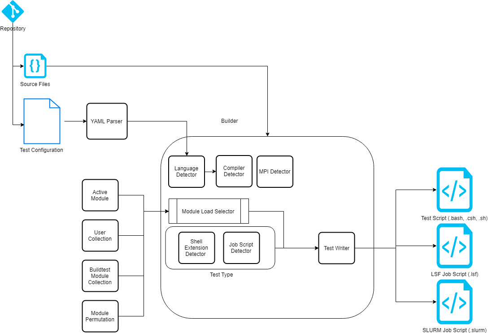

Overview
=================

.. contents::
   :backlinks: none

Workflow
---------

Shown below is a high level overview of buildtest architecture for building tests

When you clone buildtest from github, you are also getting the test configuration and source files that is required
to build the test.

In order to build a test, you will be using the ``buildtest build`` command to generate the test scripts. The test scripts
are generated by processing a test configuration (YAML) that goes through a YAML parser for type checking. In this
stage, buildtest will check all keys and values defined in the test configuration. If there is an issue with YAML parser, buildtest
will terminate, otherwise it will proceed to the **builder**.

The builder is responsible for taking the parsed YAML file and generate a test script. First, buildtest will detect the
programming language which can be determined by file extension of the source file. Second, buildtest will detect the compiler or
mpi wrapper based on programming language and details from test configuration.

buildtest will insert ``module load`` during the build phase from one of the four components:

    1. Active Modules
    2. User Collection
    3. buildtest module collection
    4. Module Permutation

During the build phase, buildtest will detect the shell extension and detect any YAML keys for job configuration. If
test configuration contains any job configuration detail, then buildtest will generate a job script, otherwise it will default
to a test script. Currently, buildtest supports LSF and SLURM when generating job script and sh, bash, and csh for test script.

Build Options (``buildtest build --help``)
---------------------------------------------

.. program-output:: cat scripts/buildtest-build-help.txt

Test Configuration
-------------------

buildtest makes use of test configuration to generate the test script. This
can be done by running ``buildtest build -c <test-config>``.

Shown below is an example run::

    $ buildtest build -c compilers.helloworld.args.c.yml
    Loading Test Configuration (YAML) file: /u/users/ssi29/gpfs/buildtest-framework/toolkit/suite/compilers/helloworld/args.c.yml
    Checking schema of YAML file
    Schema Check Passed
    Scheduler: local
    Parent Directory: /u/users/ssi29/gpfs/buildtest-framework/toolkit/suite/compilers/helloworld
    Source Directory: /u/users/ssi29/gpfs/buildtest-framework/toolkit/suite/compilers/helloworld/src
    Source File: /u/users/ssi29/gpfs/buildtest-framework/toolkit/suite/compilers/helloworld/src/args.c
    Detecting Programming Language, Compiler and MPI wrapper
    Programming Language: c
    CC: gcc
    CFLAGS: -Wall -g
    Writing Test: /tmp/ssi29/buildtest/tests/Intel/Haswell/x86_64/rhel/7.6/build_0/args.c.yml.0x827e7e93.sh
    Writing Log file to:  /tmp/ssi29/buildtest/tests/Intel/Haswell/x86_64/rhel/7.6/build_0/log/buildtest_10_44_28_10_2019.log

Buildtest starts off by loading the test configuration (YAML) and check its schema with one defined in buildtest.
Once the schema check is passed, it will proceed by checking the programming language, compiler and mpi wrapper (if necessary).
Finally, buildtest will write the test with permission: ``755``.

buildtest has two levels of verbosity that can be set by using ``-v`` option to control the output.

.. program-output:: cat scripts/build-verbose-1.txt

You may specify additional level verbosity by ``-vv`` or specify ``-v -v``
which will give additional output including the output of configuration file and test
script.

The primary difference between ``verbose=1`` and ``verbose=2`` is in ``verbose=1`` the output of test configuration is
displayed, in ``verbose=2`` the output of test script in addition to test dictionary is displayed.

.. program-output:: cat scripts/build-verbose-2.txt

For a complete list of test configuration and names that can be passed to ``buildtest build -c <testconfig>`` run the
following command::

    $ buildtest testconfigs list

See :ref:`Managing_TestConfigs` for details regarding test configuration.

Test Structure
---------------

Shown below is a brief layout of the test structure::

    {scheduler}
    {modules}
    {config vars}
    {environment vars}

    {pre_build}
    {build}
    {post_build}

    {pre_run}
    {run}
    {post_run}

When it comes to building C, C++, and Fortran program example the ``{build}`` section will differ slightly. To summarize the
``{build}`` section will be as follows::

    C Program
    $CC $CFLAGS -o $EXE $SRCFILE $LDFLAGS

    C++ Program
    $CXX $CXXFLAGS -o $EXE $SRCFILE $LDFLAGS

    Fortran Program
    $FC $FFLAGS -o $EXE $SRCFILE $LDFLAGS

Hello World C
----------------

Let's take a look at C example that will be compiled with gcc

.. program-output:: cat scripts/configuration/args.c.yml

The first line ``testtype: singlesource`` is to instruct buildtest this is a singlesource compilation. Currently, buildtest
only supports this single source compilation, but in future this can be expanded to different types.

The ``description:`` tag is brief summary of the test, limited to 80 characters. The ``scheduler: local`` instruct buildtest
this test will not use any scheduler. Other values for scheduler can include ``scheduler: LSF`` or ``scheduler: SLURM``.

The start of test specification starts with ``program:`` section that is a dictionary of ``key``:``value`` pair. The program
section comes with several keys. The ``compiler:gnu`` instructs buildtest to select gnu as the compiler, this will affect the
``{build}`` line that include $CC, $CXX, $FC variable which differ based on compilers. Currently ``compiler`` takes ``gnu`` for the
moment, and there is plans to introduce other compilers.

Every build requires a source file, this is specified by ``source:`` key which is the path to source file found in ``src``
directory relative to test configuration. To declare environment variables such as ``export FOO=BAR`` and ``export X=1``
in the test use the ``env:`` key which is a list as follows::

    env:
      FOO: BAR
      X: 1

The ``pre_build:`` and ``post_build:`` key will insert shell commands before and after the compilation. The ``cflags:``
key is used to define $CFLAGS variable during compilation, by default CFLAGS is set to ``None`` which means no flags are
passed in.

Similarly, ``pre_run:`` and ``post_run:`` will add shell commands before and after the execution of the program. The ``exec_opts:``
key is used to pass options to the executable.

The ``maintainer`` key which is outside the ``program`` block is required for all test configuration, it indicates the author of the
test which is a list of authors in the form of ``<first> <last> <email>``. This section of code can be auto-generated if
you have set ``git config user.name`` and ``git config user.email`` and buildtest will add the maintainer using the command::

    $ buildtest testconfigs maintainer -m YES <config>

To help visualize see how the test dictionary maps to the specific commands in the test script.

.. image:: test_dictionary.png
   :width: 600
   :height:  400

.. image:: test.png
   :width: 500
   :height:  250

