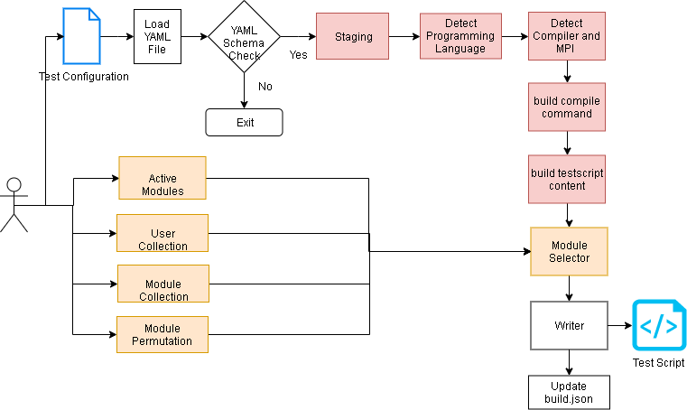
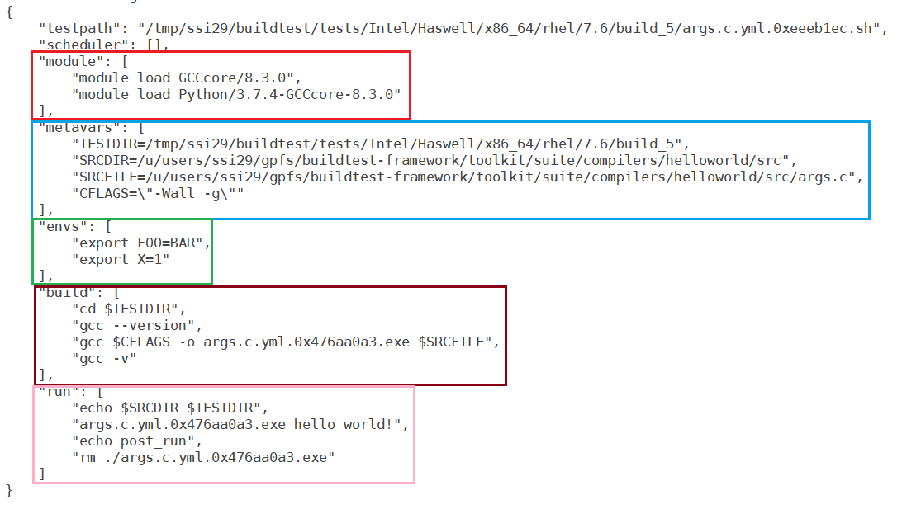
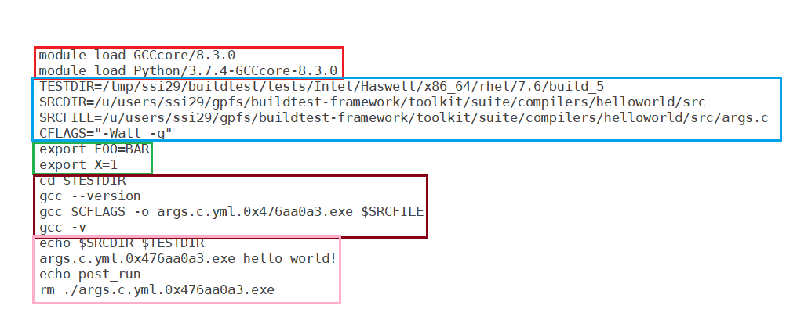

Overview
=================

.. contents::
   :backlinks: none

Build Pipeline
----------------

Shown below is a typical build pipeline for building testscripts from a test configuration.

When you clone buildtest from github, you are also getting the test configuration and source files that is required
to build the test.

In order to build a test, you will be using the ``buildtest build`` command to generate the test scripts. The test scripts
are generated by processing a test configuration (YAML) that goes through a YAML parser for type checking. In this
stage, buildtest will perform a type check for all keys and values defined in the test configuration with the YAML
schema. If there is an error during the parser stage, buildtest will terminate, otherwise it will proceed to next phase.
The ``stage`` section is where buildtest will define several variables such as **executable name**,
**source file**, **test directory** which will be written as shell variables in test script.
Shell variables are defined in ``{config vars}`` section which is discussed in :ref:`test_structure`

``Program Language Detection`` requires file extension of source file which helps detect compiler and MPI wrapper. The
wrapper with Make like variables (``CC``, ``FC``, ``CXX``). The ``build compile command`` stage will generate
the compilation line which is defined in ``{build}`` section. Finally the complete test script generation is
done in the  ``build testscript content`` section which is composed as a test dictionary. For more details see
:ref:`test_structure`

Module load is decoupled from the build process. It must be provided via CLI. The
``module selector`` stage will select from one of the four module selection types:

    1. Active Modules
    2. User Collection
    3. buildtest module collection
    4. Module Permutation

The module loads is updated in ``{module}`` section defined in :ref:`test_structure`. Finally, the
``writer`` stage will write the test content in a unique directory path and finally update file ``var/build.json``.

Build Options (``buildtest build --help``)
---------------------------------------------

.. program-output:: cat docgen/buildtest_build_-h.txt

Test Configuration
-------------------

buildtest makes use of test configuration to generate the test script. This
can be done by running ``buildtest build -c <test-config>``.

Shown below is an example build

.. program-output:: cat docgen/tutorial.compilers.args.c.yml.txt

Buildtest starts off by loading the test configuration (YAML) and check its schema with one defined in buildtest.
Once the schema check is passed, it will proceed by checking the programming language, compiler and mpi wrapper (if necessary).
Finally, buildtest will write the test with permission: ``755``.

Verbose Levels (``buildtest build -v``)
----------------------------------------

buildtest has two levels of verbosity that can be set by using ``-v`` option to control the output.

You may specify additional level verbosity by ``-vv`` or specify ``-v -v``
which will give additional output including the output of configuration file and test
script.

Shown below is an example build with verbose level 1

.. program-output:: cat docgen/tutorial.compilers.args.c.yml_v.txt

For a complete list of test configuration and names that can be passed to ``buildtest build -c <testconfig>`` run the
following command::

    $ buildtest testconfigs list

See :ref:`Managing_TestConfigs` for details regarding test configuration.

.. _test_structure:

Test Structure
---------------

Shown below is a brief layout of the test structure::

    {scheduler}
    {modules}
    {config vars}
    {environment vars}

    {pre_build}
    {build}
    {post_build}

    {pre_run}
    {run}
    {post_run}

When it comes to building C, C++, and Fortran program example the ``{build}`` section will differ slightly. To summarize the
``{build}`` section will be as follows::

    C Program
    $CC $CFLAGS -o $EXECUTABLE $SRCFILE $LDFLAGS

    C++ Program
    $CXX $CXXFLAGS -o $EXECUTABLE $SRCFILE $LDFLAGS

    Fortran Program
    $FC $FFLAGS -o $EXECUTABLE $SRCFILE $LDFLAGS

The ``{run}`` section is the execution of binary from the compiled code. The general format is the following::

   {pre_exec} $EXECUTABLE {exec_opts} {post_exec}

The ``{pre_exec}`` and ``{post_exec}`` are shell commands that can be passed before and after executable which are specified
in the test configuration. To pass arguments to executable use the ``{exec_opts}`` which can be specified in the test
configuration.

An example of a run command with the executable ``a.out`` with the following parameters for **{pre_exec}**, **{post_exec}**
and **{exec_opts}**

- ``pre_exec: OMP_NUM_THREADS=2``
- ``exec_opts: hello world``
- ``post_exec: > $HOME/output``

::

   OMP_NUM_THREADS=2 ./a.out hello world > $HOME/output

The run command will slightly differ when running MPI code but in a nutshell it will be as follows::

   {pre_exec} {launcher} {launcher_opts} <executable> {exec_opts} {post_exec}

The only difference between running serial code and MPI code is the need for ``{launcher}`` and ``{launcher_opts}`` where
**launcher** is MPI launcher (mpirun, mpiexec.hydra, mpiexec, etc...) and **launcher_opts** is the options to MPI launcher.
The MPI launcher and launcher options can be specified in the test configuration. For more information on MPI build see
:ref:`mpi_example`

Hello World C
----------------

Let's take a look at C example that will be compiled with gcc

.. program-output:: cat ../toolkit/suite/tutorial/compilers/args.c.yml

The first line ``testtype: singlesource`` is to instruct buildtest this is a singlesource compilation. Currently, buildtest
only supports this single source compilation, but in future this can be expanded to different types.

The ``description:`` tag is brief summary of the test, limited to 80 characters. The ``scheduler: local`` instruct buildtest
this test will not use any scheduler. Other values for scheduler can include ``scheduler: LSF`` or ``scheduler: SLURM``.

The start of test specification starts with ``program:`` section that is a dictionary of ``key``:``value`` pair. The program
section comes with several keys. The ``compiler:gnu`` instructs buildtest to select gnu as the compiler, this will affect the
``{build}`` line that include $CC, $CXX, $FC variable which differ based on compilers. Currently ``compiler`` takes ``gnu`` for the
moment, and there is plans to introduce other compilers.

Every build requires a source file, this is specified by ``source:`` key which is the path to source file found in ``src``
directory relative to test configuration. To declare environment variables such as ``export FOO=BAR`` and ``export X=1``
in the test use the ``env:`` key which is a list as follows::

    env:
      FOO: BAR
      X: 1

The ``pre_build:`` and ``post_build:`` key will insert shell commands before and after the compilation. The ``cflags:``
key is used to define $CFLAGS variable during compilation, by default CFLAGS is set to ``None`` which means no flags are
passed in.

Similarly, ``pre_run:`` and ``post_run:`` will add shell commands before and after the execution of the program. The ``exec_opts:``
key is used to pass options to the executable.

The ``maintainer`` key which is outside the ``program`` block is required for all test configuration, it indicates the author of the
test which is a list of authors in the form of ``<first> <last> <email>``.

To help visualize see how the test dictionary maps to the specific commands in the test script.

For a list of keys see :ref:`singlesource_schema`

Dry Run (``buildtest build --dry``)
-----------------------------------

buildtest provides a dry run mode that shows the content of test script without actually creating the test script. This
can be useful when writing your test configuration. To utilize the dry run option use the ``-d`` or long option ``--dry``
when building test.

Shown below is an example dry run build.

.. program-output:: cat docgen/tutorial.compilers.args.c.yml_dry.txt

Delete All builds (``buildtest build --clear``)
-----------------------------------------------------

If you want to delete all builds, this can be done via ``buildtest build --clear``. This will remove all tests and
remove all entries from ``build.json``. Removing entries from ``build.json`` will affect
commands like ``buildtest build [ report | test | run | log | bsub ]`` since they rely on build IDs. Deleting the builds also
remove the build IDs where build IDs correspond to a unique build entry in ``build.json``. For more details see :ref:`build_status`

Shown below is an output after clearing the builds.

.. program-output:: cat docgen/buildtest-build-clear.txt

Test Directory Layout
----------------------

buildtest will store the test defined by configuration ``build[testdir]`` defined in **settings.yml**. Buildtest will
detect system details such as vendor id, architecture, platform, operating system that get inserted into the directory
structure. Every build (``buildtest build``) will increment the build ID to distinguish between previous builds.
Shown below is a basic structure of the directory layout::

   $ tree /tmp/ssi29/buildtest/tests/
   /tmp/ssi29/buildtest/tests/
   └── Intel
       └── Haswell
           └── x86_64
               └── rhel
                   └── 7.6
                       ├── build_0
                       │   ├── args.c.yml.0xe93836d1.sh
                       │   └── log
                       │       └── buildtest_14_40_28_10_2019.log
                       ├── build_1
                       │   ├── args.c.yml.0x2f83e661.sh
                       │   └── log
                       │       └── buildtest_14_40_28_10_2019.log
                       ├── build_2
                       │   ├── args.c.yml.0x722fa01.sh
                       │   └── log
                       │       └── buildtest_14_40_28_10_2019.log
                       ├── build_3
                       │   ├── hello_lsf.yml.0x5afd4bd1.sh
                       │   └── log
                       │       └── buildtest_14_40_28_10_2019.log
                       └── build_4
                           ├── hello_slurm.yml.0x915e39fb.sh
                           └── log
                               └── buildtest_14_40_28_10_2019.log

   15 directories, 10 files

Every build will have a directory such as ``build_0``, ``build_1``, ``build_2``, ... starting from 0 index. The test script
and log file will be stored in this directory.

Buildtest internal files
--------------------------

buildtest maintains a set of json files in the **var** directory that are self managed by buildtest.

The following files are generally found in var directory::

   $ tree var/
   var/
   ├── build.json
   ├── collection.json
   └── spider.json

   0 directories, 3 files

**build.json** keeps track of every build performed by buildtest. Every build will be denoted by a
build **ID** that is used for distinguishing different builds. **build.json** is read by buildtest
for commands such as *buildtest build* [ ``report`` | ``test`` | ``run`` | ``log`` ] commands.
For more information see :ref:`build_status`

**collection.json** is a self-managed file used to store module collections that is managed by command ``buildtest module collection``.
For more information on module collection see :ref:`module_collection`

**spider.json** caches the content of Lmod spider in file to avoid rerunning spider every time. This file is updated
whenever buildtest detects change in ``BUILDTEST_MODULEPATH``. This file is used by buildtest for all the module operations.

