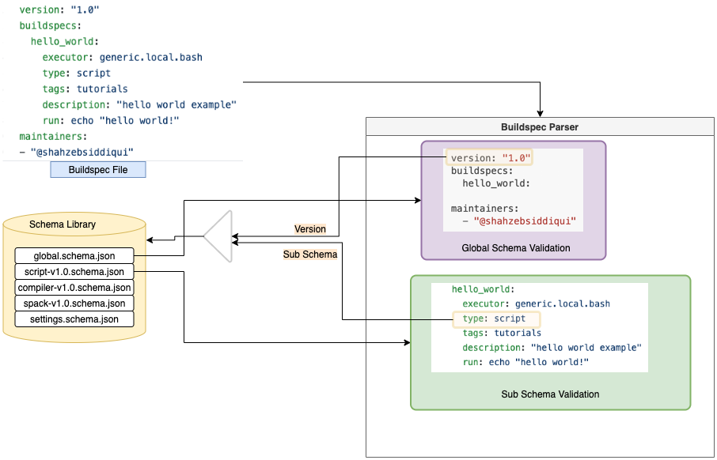

.. _build_and_test_process:

Build and Test Process
======================

Pipeline
---------

The `buildtest build` command is responsible for building and running tests. Every buildspec
goes through a pipeline that discovers buildspecs, validates the buildspec and builds and runs
the test. The buildspec must go through each stage of the pipeline, if it fails in one of the stage,
the buildspec will be ignored.

.. image:: _static/GeneralPipeline.png

Discover Buildspecs
~~~~~~~~~~~~~~~~~~~~

buildtest will discover buildspecs based on command line arguments since you can
build by file, directory, executor, or tags.  In **discover** stage, buildtest
will detect buildspecs which is discussed in :ref:`discover_buildspecs` .

For every discovered buildspecs, buildtest will validate the buildspecs in the **parse**
stage which is performed using `jsonschema.validate <https://python-jsonschema.readthedocs.io/en/stable/validate/#jsonschema.validate>`_ library.
The parser will validate every buildspec with the global schema named `global.schema.json <https://github.com/buildtesters/buildtest/blob/gh-pages/pages/schemas/global.schema.json>`_
and one of the sub-schemas, check :ref:`parsing buildspecs <parse_stage>` section for more details.

.. _parse_stage:

Parse Buildspecs
~~~~~~~~~~~~~~~~~

A buildspec file may contain one or more test sections specified via ``buildspec``
field. Each test is validated by a sub-schema specified by ``type`` field.
buildtest will validate the buildspec with global schema first followed by sub-schema
by using the ``version`` field to look up the schema version for sub-schema. buildtest
will look up the schema from its schema library and validate the test section ``hello_world``
with schema ``script-v1.0.schema.json``.

Buildspecs will be ignored if it fails validation process for instance you may have an :ref:`invalid_buildspecs`.
Invalid buildspecs won't be sent to **build** stage since we can't reliably build a test-script.

Building Buildspecs
~~~~~~~~~~~~~~~~~~~~~

buildtest will send all valid buildspecs to **build** phase which is responsible for building
a shell-script from the buildspec file. In this stage, we create a **Builder** object
that is an instance of `BuilderBase <https://github.com/buildtesters/buildtest/blob/devel/buildtest/buildsystem/base.py>`_  class that is a base
class for building a buildspec. There is a sub-class for `BuilderBase` class such as `ScriptBuilder <https://github.com/buildtesters/buildtest/blob/devel/buildtest/buildsystem/scriptbuilder.py>`_
and `CompilerBuilder <https://github.com/buildtesters/buildtest/blob/devel/buildtest/buildsystem/compilerbuilder.py>`_ that implements
how to build a test-script based on the sub-schema selection (``type: compiler``).

During build phase, there are additional checks on buildspecs to ensure we can generate a test-script. In the event
of failure, buildtest will raise an exception and buildspec will be ignored. The ignored buildspecs are not sent to **run**
stage

Running Buildspecs
~~~~~~~~~~~~~~~~~~~~

In this stage, we run the test based on :ref:`executors <configuring_executors>` defined in configuration file. buildtest will
select the executor defined by ``executor`` property in buildspec which is responsible for running the test. There is a `BaseExecutor <https://github.com/buildtesters/buildtest/blob/devel/buildtest/executors/base.py>`_
that is a base-class for all executors. We have sub-class for each executor type (Local, Slurm, Cobalt, PBS, Cobalt). In this stage,
we run the test and get output, error, returncode and detect status of test (``PASS``, ``FAIL``). If test is run via scheduler,
we submit job to scheduler and poll jobID until it is finished.

Upon completion of test, we update the **Builder** object with the test results which is written to report file.

