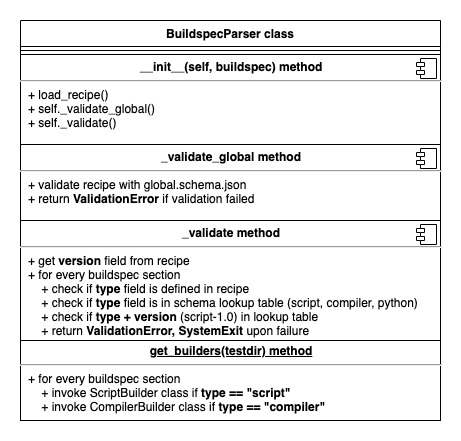
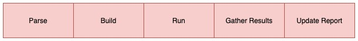
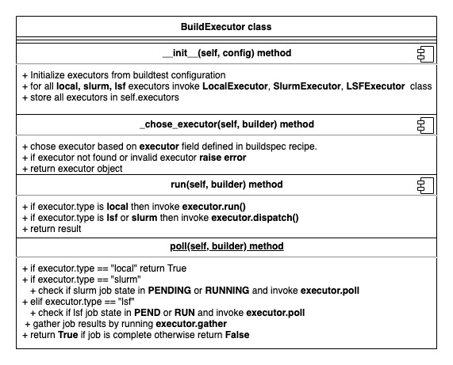

Builder Process
=================

buildtest will process all buildspecs that are discovered see diagram :ref:`discover_buildspecs`.
The **BuildspecParser** class is responsible for validating the buildspec. The
validation is performed using `jsonschema.validate <https://python-jsonschema.readthedocs.io/en/stable/validate/#jsonschema.validate>`_.
The parser will validate every buildspec using the `global.schema.json <https://buildtesters.github.io/schemas/schemadocs/global>`_
which validates the top-level structure. This is performed using ``BuildspecParser._validate_global``
method.

A buildspec file may contain one or more test sections specified via ``buildspec``
field. Each test is validated by a sub-schema specified by ``type`` field.
The ``BuildspecParser._validate`` method will validate buildspec test section with
the sub-schema.

buildtest will invoke BuildspecParser against all discovered buildspecs and catch
exceptions **ValidationError** and **SystemExit** and ignore those buildspecs. Next
buildtest will build each test, this is implemented using base class `BuilderBase`.
There is a subclass for **BuilderBase** responsible for generating test based on the
`type` field.

For example if ``type: script``, then buildtest will invoke **ScriptBuilder** class
responsible for generating testscript. Likewise, if ``type: compiler`` in buildspec,
then buildtest will invoke **CompilerBuilder** class. This allows buildtest to extend
**BuilderBase** class and each subclass is responsible for one schema type.

The build pipeline is comprised of 5 stages shown below. Every buildspec goes
through this pipeline, if one stage fails, buildtest will skip the test. For instance,
a buildspec that fails ``Parse`` stage will not be built. It is possible a
buildspec passes ``Parse`` stage but fails to build because we have an :ref:`invalid_buildspecs`
for example an invalid executor name.

The **BuildExecutor** class is responsible for initializing the executors defined
in your :ref:`configuring_buildtest`. The BuildExecutor class is invoked once and
buildtest configuration is passed to this class. buildtest will process all executors defined in `executors` field by invoking the appropriate sub-class.
The `local`, `slurm`, `lsf` executors are implemented in class
**LocalExecutor**, **SlurmExecutor**, **LSFExecutor** that are sub-class of
of **BaseExecutor**. The BaseExecutor class is responsible for implementing common
methods for all executors. Each executor class is responsible for running test that is performed in the **Run** stage of the
general pipeline.

