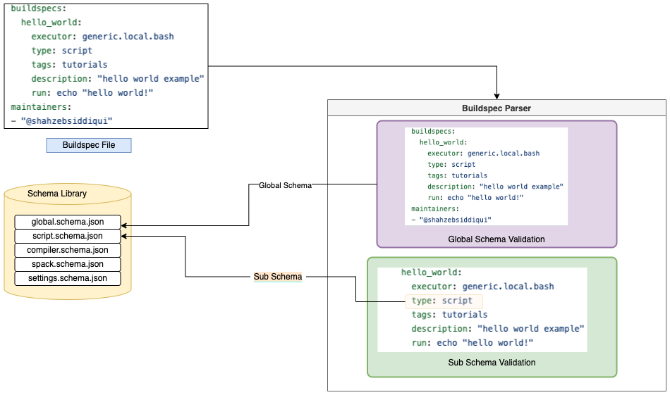

.. _build_and_test_process:

Build and Test Process
======================

The **buildtest build** command is responsible for building and running tests on your system given
one or more buildspecs.

Every buildspec goes through a pipeline that includes the following stages:

- :ref:`Discover <discover_buildspecs>`
- :ref:`Parse <parse_buildspecs>`
- :ref:`Build <building_buildspecs>`
- :ref:`Run <run_stage>`
- :ref:`Sanity Check <sanity_stage>`
- :ref:`Update Report <update_report_stage>`

The buildspec must go through each stage of the pipeline, if it fails in one of the stage,
the buildspec will be ignored.

.. _discover_buildspecs:

Discover Buildspecs
---------------------

buildtest will discover buildspecs based on command line arguments since you can
build by file, directory, executor, or tags.

The buildspec search resolution is described as follows:

- If file or directory specified by ``--buildspec`` option doesn't exist we exit immediately.

- If buildspec path is a directory, traverse directory recursively to find all ``.yml`` extensions

- If buildspec path is a file, check if file extension is not ``.yml``,  exit immediately

- If user specifies ``--tags`` or ``--executor`` we search in buildspec cache to discover buildspecs.

Shown below is a diagram on how buildtest discovers buildspecs. The user can build buildspecs
by ``--buildspec``, :ref:`--tags <build_by_tags>`, or :ref:`--executor <build_by_executor>`
which will discover the buildspecs. You can :ref:`exclude buildspecs <exclude_buildspecs>`
using ``--exclude`` option which is processed after discovering buildspecs. The
excluded buildspecs are removed from list if found and final list of buildspecs
is processed.

.. image:: _static/DiscoverBuildspecs.jpg
   :scale: 75 %

For every discovered buildspecs, buildtest will validate the buildspecs in the :ref:`parse stage <parse_buildspecs>` to
ensure buildspec is a valid YAML file according to schema json schema.

.. _parse_buildspecs:

Parse Buildspecs
---------------------

buildtest will validate each buildspec via JSON schema using `jsonschema.validate <https://python-jsonschema.readthedocs.io/en/stable/validate/#jsonschema.validate>`_
library. The parser will validate every buildspec with the :ref:`global_schema` using schema file
`global.schema.json <https://github.com/buildtesters/buildtest/blob/devel/buildtest/schemas/global.schema.json>`_.

A buildspec is composed of one or more test sections specified via ``buildspec``
field. Each test is validated by a sub-schema specified by ``type`` field. In this diagram below,
we have a test **hello_world**  that uses ``type: script`` which informs buildtest to validate
this test with schema ``script.schema.json``.

buildtest will ignore any buildspecs that fail validation process for instance you may have an
:ref:`invalid buildspec <invalid_buildspecs>`. buildtest will send valid buildspecs to the
:ref:`build stage <building_buildspecs>` which is responsible for building a shell-script.

.. _building_buildspecs:

Building Buildspecs
---------------------

In this stage, buildtest is responsible for building a shell-script by parsing the content of buildspec and writing test to disk.
Buildtest will create a **Builder** object that is an instance of `BuilderBase <https://github.com/buildtesters/buildtest/blob/devel/buildtest/builders/base.py>`_  class
which embodies the test that will be run. Every **Builder** object has a unique hash that is used to identify the test. The hash is used to create
unique directory on disk where buildtest will write contents of test and corresponding files. Assuming a test was run successfully, you can
use ``buildtest path`` to retrieve directory path. In example below we show root directory of a test and content of the directory.
For each test (`always_fail`), buildtest will write **.out** and **.err** files which correspond to output and error file. The generated script is ``always_fail.sh`` and
a wrapper script ``always_fail_build.sh`` is the script ran by buildtest which will invoke the generated script.
.. code-block:: console

      buildtest path always_fail/b758eb5a-854e-4ef4-909c-b4376d970117
    /Users/siddiq90/Documents/github/buildtest/var/tests/generic.local.sh/explicit_state/always_fail/b758eb5a

     ls -l $(buildtest path always_fail/b758eb5a-854e-4ef4-909c-b4376d970117)
    total 24
    -rw-r--r--   1 siddiq90  92503     0 Jan 23 13:29 always_fail.err
    -rw-r--r--   1 siddiq90  92503     0 Jan 23 13:29 always_fail.out
    -rwxr-xr-x   1 siddiq90  92503    42 Jan 23 13:29 always_fail.sh
    -rwxr-xr-x   1 siddiq90  92503   771 Jan 23 13:29 always_fail_build.sh
    -rw-r--r--   1 siddiq90  92503  3220 Jan 23 13:29 build-env.txt
    drwxr-xr-x  15 siddiq90  92503   480 Jan 23 13:29 stage

In the event of failure, buildtest will raise an exception and buildspec will be ignored.

.. _run_stage:

Running Buildspecs
---------------------

In this stage, we run the test based on :ref:`executors <configuring_executors>` defined in configuration file. buildtest will
select the executor defined by ``executor`` property in buildspec which is responsible for running the test. There is a
`BaseExecutor <https://github.com/buildtesters/buildtest/blob/devel/buildtest/executors/base.py>`_ that is a base-class for
all executors. buildtest will run tests in parallel and wait for completion.
buildtest can submit jobs to :ref:`batch scheduler <batch_support>` depending on content of test, in this event buildtest will
dispatch job, retrieve jobID and poll job until completion.

Once test is complete, buildtest will write output and error to disk.

.. _sanity_stage:

Sanity Check
-------------

Once test is complete, buildtest will run a series of sanity check to determine state of test which can be ``PASS`` or ``FAIL``.
The default behavior is returncode, if its 0 test is ``PASS`` otherwise its a ``FAIL``. buildtest supports several :ref:`status <status>` checks
in addition to :ref:`performance checks <perf_checks>`.

.. _update_report_stage:

Update Report
---------------

Buildtest will write all tests and corresponding metadata for each test to report file. The report file is a JSON file that is
updated upon every **buildtest build** command which allows buildtest to keep track of previous builds. The report file can be queried
via ``buildtest report`` or ``buildtest inspect``.

buildtest will write report to default report file unless ``buildtest build -r /path/to/report.json`` is specified.

