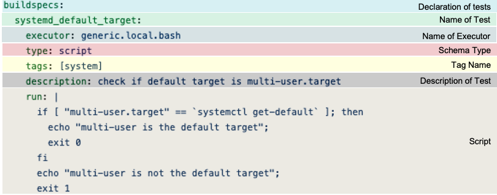

.. _global_schema:

Global Schema
==============

The global schema is validated with for all schema types and is the top-level
schema when defining a buildspec file.

For more details see `Global Schema Documentation <https://buildtesters.github.io/buildtest/pages/schemadocs/global.html>`_.

Global Keys in buildspec
--------------------------

Shown below is the start of the global.schema.json

.. code-block:: json

  "$id": "global.schema.json",
  "$schema": "http://json-schema.org/draft-07/schema#",
  "title": "global schema",
  "description": "buildtest global schema is validated for all buildspecs. The global schema defines top-level structure of buildspec and defintions that are inherited for sub-schemas",
  "type": "object",
  "required": ["version","buildspecs"],

The global keys required for any buildspec are ``version`` and ``buildspecs``. The
version key is required to lookup an a sub-schema using the ``type`` field.
The ``buildspecs`` is the start of test declaration. The ``maintainers`` is an optional
field that is an array test maintainers. To understand
how buildtest validates the buildspec see :ref:`parse_stage`.

Shown below is an example buildspec.

.. program-output:: cat ../tutorials/hello_world.yml

In this example, the global schema validates the following section:

.. code-block:: yaml

    version: "1.0"
    buildspecs:
      hello_world:

    maintainers:
      - "@shahzebsiddiqui"

The field ``version`` ``buildspecs`` and ``maintainers`` are validated with **global.schema.json**
using `jsonschema.validate <https://python-jsonschema.readthedocs.io/en/stable/_modules/jsonschema/validators/#validate>`_
method. The test section within ``hello_world`` is validated by sub-schema by looking up schema based
on ``type`` field:

.. code-block:: yaml

    hello_world:
      executor: generic.local.bash
      type: script
      description: "hello world example"
      run: echo "hello world!"

Every sub-schema requires **type** field in this case, ``type: script`` directs
buildtest to validate with the script schema. All type schemas have a version,
currently buildtest supports **1.0** version for all type schemas. The
``version: "1.0"`` is used to select the version of the sub-schema,
in this example we validate with the schema `script-v1.0.schema.json <https://buildtesters.github.io/buildtest/pages/schemas/script-v1.0.schema.json>`_.

Test Names
-----------

The **buildspecs** property is a JSON object that defines one or more test. This
is defined in JSON as follows:

.. code-block:: json

    "buildspecs": {
      "type": "object",
       "description": "This section is used to define one or more tests (buildspecs). Each test must be unique name",
       "propertyNames": {
          "pattern": "^[A-Za-z_.][A-Za-z0-9_.]*$",
          "maxLength": 32
       }
    }

The test names take the following pattern ``"^[A-Za-z_.][A-Za-z0-9_.]*$"`` and limited
to 32 characters. In previous example, the test name is **hello_world**. You must have unique
testname in your **buildspecs** section, otherwise you will have an invalid buildspec
file. The ``description`` field is used to document the test and limited to 80 characters.

.. Note:: We refer to the entire YAML content as **buildspec file**, this is not to be confused with the **buildspecs** field.

Buildspec Structure
--------------------

Shown below is an overview of buildspec file. In this diagram we define one test within
``buildspecs`` property named ``systemd_default_target``. This test is using the
script schema defined by ``type: script``.  The ``executor`` property is a required
property that determines how test is run. The executors are defined in buildtest configuration
see :ref:`configuring_buildtest` for more details.

The ``run`` property is used for defining content of script, this can a shell-script
(bash,csh) or python script.

Please proceed to :ref:`buildspec_overview` to learn more about buildspecs.

