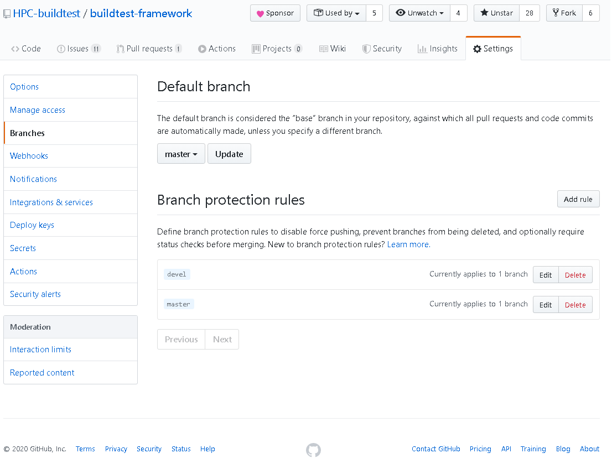
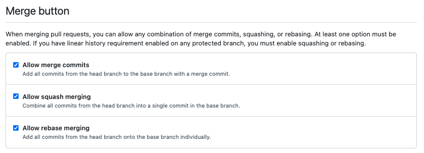

Maintainer Guide
================

This is a guide for buildtest maintainers

Incoming Pull Request
------------------------

These are just a few points to consider when dealing with incoming pull requests

1. Any incoming Pull Request should be assigned to one or more maintainers for review.

2. Upon approval, the PR should be **Squash and Merge**. If it's important to preserve a few commits during PR then **Rebase and Merge** is acceptable.

3. The final commit PR commit, either Squash Commit or Rebase should have meaningful comments and if possible link to the github issue.

4. Maintainers can request user to put meaningful commit if author has not provided a meaningful message (i.e ``git commit --amend``)

5. All incoming PRs should be label by maintainer to help sort through PRs. Trafico and Pull Request bot will label PRs with additional labels, the maintainers are responsible for labeling PRs based on functionality.

6. Maintainers are requested that committer name and email is from a valid Github account. If not please request the committer to fix the author name and email.

7. All incoming PRs should be pushed to ``devel`` branch, if you see any PR sent to any other branch please inform code owner to fix it

Release Process
-----------------

Every buildtest release will be tagged with a version number using format **X.Y.Z**. Every release will have a git tags
such as ``v1.2.3`` to correspond to release **1.2.3**. Git tags should be pushed to upstream by **release manager** only.
The process for pushing git tags can be described in the following article:  `Git Basics - Tagging <https://git-scm.com/book/en/v2/Git-Basics-Tagging>`_

We will create annotated tags as follows::

  git tag -a v1.2.3 -m "buildtest version 1.2.3"

Once tag is created you can view the tag details by running either::

  git tag
  git show v1.2.3

We have created the tag locally, next we must push the tag to the upstream repo by doing the following::

  git push origin v.1.2.3

Every release must have a release note that is maintained in file `CHANGELOG.rst <https://github.com/HPC-buildtest/buildtest-framework/blob/master/CHANGELOG.rst>`_

Under buildtest `releases <https://github.com/HPC-buildtest/buildtest-framework/releases>`_ a new release can be created that
corresponds to the git tag. In the release summary, just direct with a message stating **refer to CHANGELOG.rst for more details**

Once the release is published, make sure to open a pull request from ``devel`` --> ``master`` and **Rebase and Merge**
to master branch. If there are conflicts during merge for any reason, then simply remove ``master`` and create a master
branch from devel.

Default Branch
------------------

The ``master`` branch should be setup as the default branch.

Branch Settings
----------------

All maintainers are encouraged to view branch `settings <https://github.com/HPC-buildtest/buildtest-framework/settings/branches>`_
for ``devel`` and ``master``. If something is not correct please consult with the maintainers.

The master and devel branches should be protected branches and master should be enabled as default branch. Shown
below is the expected configuration.

Merge Settings
----------------

We have disabled ``Merge Commits`` for the Merge button in Pull Request.  This was done because we
wanted a linear history as a requirement for ``devel`` branch. This avoids having a maintainer accidently
merge a PR with ``Merge Commit`` which adds an extra commit.

Shown below is the recommended configuration.

If you notice a deviation, please consult with the maintainers.

Google Analytics
-----------------

The buildtest site is tracked via Google Analytics, if you are interested in get access contact **Shahzeb Siddiqui (@shahzebsiddiqui)**

Read The Docs Access
---------------------

buildtest project for readthedocs can be found at https://readthedocs.org/projects/buildtest/. If you need
to administer project configuration, please contact **Shahzeb Siddiqui @shahzebsiddiqui** to gain access.

Slack Admin Access
-------------------

If you need admin access to Slack Channel please contact **Shahzeb Siddiqui @shahzebsiddiqui**. The
slack admin link is https://hpcbuildtest.slack.com/admin
