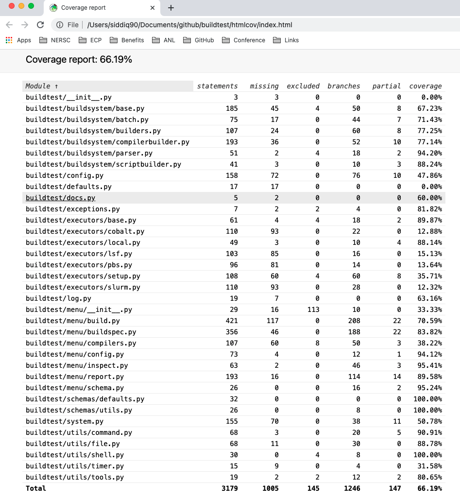

Buildtest Unit Tests
=====================

buildtest has a suite of unit tests to verify the state of buildtest. These
tests are located in the top-level directory `tests <https://github.com/buildtesters/buildtest/tree/devel/tests>`_
and run via `pytest <https://docs.pytest.org/en/latest/>`_

In order to run regression tests, you will need ``pytest`` and ``coverage``
in your python environment. This should be available if you installed buildtest and also run `pip install -r docs/requirements.txt`
which installs all developer dependencies.

Writing Unit Tests
-------------------

If you want to write a new test, you should be familiar with
`coverage <https://coverage.readthedocs.io/>`_ report that is pushed to `codecov <https://codecov.io/gh/buildtesters/buildtest>`_.
The coverage report will give a detailed line-line coverage of source
code HIT/MISS when running the unit test. We welcome user contribution that
will help increasing test coverage, in addition new features added to buildtest would require test to
ensure they are working properly.

The `tests <https://github.com/buildtesters/buildtest/tree/devel/tests>`_ directory is structured in a way
that each source file has a corresponding test file that starts with ``test_``. For instance,
if you want to write a test for ``buildtest/utils/command.py``, there will be a corresponding
test under ``tests/utils/test_command.py``.

If you adding a new directory, make sure the name corresponds to one found under
``buildtest`` directory  and add a ``__init__.py`` in the new directory. This is
required by pytest for test discovery. All test methods must start
with **test_** in order for pytest to run your regression test.

Shown below is a simple test that always passes

.. code-block:: python

       def test_regression_example1():
            assert True

For more details on writing tests with pytest see
`Getting-Started <https://docs.pytest.org/en/latest/getting-started.html#installation-and-getting-started>`_.

Running Unit Test
------------------------

The **buildtest unittests** command can be used to run buildtest unit test. Shown
below is the help option for ``buildtest unittests`` command.

.. command-output:: buildtest unittests --help

If you decide to run all regression test you can simply run ``buildtest unittests``. The ``--pytestopts`` can be used to
specify option to ``pytest`` when running unit test. The ``--sourcefiles`` option can be used to specify list of files or
directories to run unit test. The `--sourcefiles` option can be specified multiple times and it can be an absolute or relative path.
The ``--coverage`` option can be used to enable coverage when running regression test, by default this is disabled.

In example, we can specify options to pytest and specify arbitrary source files which can be useful if you want to run
a subset of regression test without running all of them.

.. code-block:: console

    $ buildtest unittests --pytestopts="-v" -s $BUILDTEST_ROOT/tests/utils/test_shell.py -s $BUILDTEST_ROOT/tests/utils/test_command.py
    ========================================================================================================== test session starts ===========================================================================================================
    platform darwin -- Python 3.7.3, pytest-6.2.5, py-1.11.0, pluggy-1.0.0 -- /Users/siddiq90/.local/share/virtualenvs/buildtest-KLOcDrW0/bin/python3
    cachedir: .pytest_cache
    rootdir: /Users/siddiq90/Documents/GitHubDesktop/buildtest, configfile: pytest.ini
    collected 10 items

    ../tests/utils/test_shell.py::TestShell::test_default_shell <- ../../../../../tmp/tests/utils/test_shell.py PASSED                                                                                                                 [ 10%]
    ../tests/utils/test_shell.py::TestShell::test_sh_shell <- ../../../../../tmp/tests/utils/test_shell.py PASSED                                                                                                                      [ 20%]
    ../tests/utils/test_shell.py::TestShell::test_bash_shell <- ../../../../../tmp/tests/utils/test_shell.py PASSED                                                                                                                    [ 30%]
    ../tests/utils/test_shell.py::TestShell::test_zsh_shell <- ../../../../../tmp/tests/utils/test_shell.py SKIPPED (Skipping test for zsh shell)                                                                                      [ 40%]
    ../tests/utils/test_shell.py::TestShell::test_csh_shell <- ../../../../../tmp/tests/utils/test_shell.py SKIPPED (Skipping test for csh shell)                                                                                      [ 50%]
    ../tests/utils/test_shell.py::TestShell::test_tcsh_shell <- ../../../../../tmp/tests/utils/test_shell.py SKIPPED (Skipping test for tcsh shell)                                                                                    [ 60%]
    ../tests/utils/test_shell.py::TestShell::test_update_instance <- ../../../../../tmp/tests/utils/test_shell.py PASSED                                                                                                               [ 70%]
    ../tests/utils/test_shell.py::TestShell::test_shell_exceptions <- ../../../../../tmp/tests/utils/test_shell.py PASSED                                                                                                              [ 80%]
    ../tests/utils/test_command.py::TestBuildTestCommand::test_command <- ../../../../../tmp/tests/utils/test_command.py PASSED                                                                                                        [ 90%]
    ../tests/utils/test_command.py::TestBuildTestCommand::test_error_command <- ../../../../../tmp/tests/utils/test_command.py PASSED                                                                                                  [100%]

    ========================================================================================================== slowest 20 durations ==========================================================================================================
    0.01s call     tests/utils/test_command.py::TestBuildTestCommand::test_command
    0.00s setup    tests/utils/test_shell.py::TestShell::test_shell_exceptions
    0.00s call     tests/utils/test_shell.py::TestShell::test_shell_exceptions
    0.00s call     tests/utils/test_shell.py::TestShell::test_sh_shell
    0.00s call     tests/utils/test_shell.py::TestShell::test_bash_shell
    0.00s setup    tests/utils/test_shell.py::TestShell::test_default_shell
    0.00s call     tests/utils/test_shell.py::TestShell::test_default_shell
    0.00s call     tests/utils/test_shell.py::TestShell::test_update_instance
    0.00s call     tests/utils/test_command.py::TestBuildTestCommand::test_error_command
    0.00s teardown tests/utils/test_command.py::TestBuildTestCommand::test_error_command
    0.00s setup    tests/utils/test_shell.py::TestShell::test_bash_shell
    0.00s teardown tests/utils/test_command.py::TestBuildTestCommand::test_command
    0.00s call     tests/utils/test_shell.py::TestShell::test_tcsh_shell
    0.00s call     tests/utils/test_shell.py::TestShell::test_zsh_shell
    0.00s setup    tests/utils/test_shell.py::TestShell::test_tcsh_shell
    0.00s teardown tests/utils/test_shell.py::TestShell::test_zsh_shell
    0.00s teardown tests/utils/test_shell.py::TestShell::test_shell_exceptions
    0.00s setup    tests/utils/test_shell.py::TestShell::test_zsh_shell
    0.00s setup    tests/utils/test_shell.py::TestShell::test_update_instance
    0.00s setup    tests/utils/test_command.py::TestBuildTestCommand::test_error_command
    ======================================================================================================== short test summary info =========================================================================================================
    SKIPPED [1] ../../../../../../tmp/tests/utils/test_shell.py:57: Skipping test for zsh shell
    SKIPPED [1] ../../../../../../tmp/tests/utils/test_shell.py:73: Skipping test for csh shell
    SKIPPED [1] ../../../../../../tmp/tests/utils/test_shell.py:89: Skipping test for tcsh shell
    ====================================================================================================== 7 passed, 3 skipped in 0.04s ======================================================================================================

You can run buildtest unittest via python by running the following script

.. code-block::

    python $BUILDTEST_ROOT/buildtest/tools/unittests.py

The ``buildtest unittest`` command will run this script, shown below are the options if you want to run
the script via python

.. command-output:: python $BUILDTEST_ROOT/buildtest/tools/unittests.py --help

The `pytest.ini <https://github.com/buildtesters/buildtest/blob/devel/pytest.ini>`_
found in top-level folder defines pytest configuration for running the unit tests. Some of the unit tests are
assigned a `marker <https://docs.pytest.org/en/6.2.x/example/markers.html>`_ which allows one to run a group of test together. You
can find all markers by running ``pytest --markers``.

If you want to run all tests with ``schema`` marker you can do the following::

   # run via buildtest unittests
   buildtest unittests -p="-m schema"

   # run via script
   python $BUILDTEST_ROOT/buildtest/tools/unittests.py -p="-m schema"

For a complete list of options refer to pytest `documentation <https://docs.pytest.org/en/latest/contents.html>`_
or run ``pytest --help``.

.. _coverage_test:

Running test via coverage
--------------------------

There is a coverage configuration file `.coveragerc <https://github.com/buildtesters/buildtest/blob/devel/.coveragerc>`_ located
in root of buildtest that is read by **coverage** utility. The `buildtest/tools/unittests.py <https://github.com/buildtesters/buildtest/blob/devel/buildtest/tools/unittests.py>`_  script
will collect coverage details upon completion of regression test which is equivalent to running ``coverage run -m pytest`` but we make some additional checks when
running the script.

To enable coverage report during regression test you can pass the ``--coverage`` option. The output will show results via `coverage report`
and link to coverage results which can be viewed in your browser. In next example we run unit test with coverage report.

.. code-block:: console

    $ python $BUILDTEST_ROOT/buildtest/tools/unittests.py -p="-m schema" -c
    ============================================================================= test session starts =============================================================================
    platform darwin -- Python 3.7.3, pytest-6.2.5, py-1.11.0, pluggy-1.0.0 -- /Users/siddiq90/.local/share/virtualenvs/buildtest-KLOcDrW0/bin/python
    cachedir: .pytest_cache
    rootdir: /Users/siddiq90/Documents/GitHubDesktop/buildtest, configfile: pytest.ini
    collected 107 items / 101 deselected / 6 selected

    tests/cli/test_schema.py::test_schema_cmd PASSED                                                                                                                        [ 16%]
    tests/schema_tests/test_compiler.py::test_compiler_examples PASSED                                                                                                      [ 33%]
    tests/schema_tests/test_global.py::test_global_examples PASSED                                                                                                          [ 50%]
    tests/schema_tests/test_script.py::test_script_examples PASSED                                                                                                          [ 66%]
    tests/schema_tests/test_settings.py::test_settings_examples PASSED                                                                                                      [ 83%]
    tests/schema_tests/test_spack.py::test_spack_examples PASSED                                                                                                            [100%]

    ============================================================================ slowest 20 durations =============================================================================
    0.57s call     tests/cli/test_schema.py::test_schema_cmd
    0.18s call     tests/schema_tests/test_compiler.py::test_compiler_examples
    0.14s call     tests/schema_tests/test_script.py::test_script_examples
    0.08s call     tests/schema_tests/test_spack.py::test_spack_examples
    0.06s call     tests/schema_tests/test_settings.py::test_settings_examples
    0.01s call     tests/schema_tests/test_global.py::test_global_examples

    (12 durations < 0.005s hidden.  Use -vv to show these durations.)
    ====================================================================== 6 passed, 101 deselected in 1.60s ======================================================================
    Name                                       Stmts   Miss Branch BrPart     Cover
    -------------------------------------------------------------------------------
    buildtest/utils/tools.py                       3      0      2      0   100.00%
    buildtest/schemas/defaults.py                 36      0      0      0   100.00%
    buildtest/cli/schema.py                       28      0     16      2    95.45%
    buildtest/utils/command.py                    76      8     24      6    86.00%
    buildtest/utils/shell.py                      69     15     22      6    76.92%
    buildtest/executors/job.py                    13      4      2      0    73.33%
    buildtest/schemas/utils.py                    25      6      8      4    69.70%
    buildtest/system.py                          191     87     54     14    53.06%
    buildtest/executors/base.py                   20     10      4      0    50.00%
    buildtest/utils/timer.py                      17     10      8      0    44.00%
    buildtest/buildsystem/batch.py                31     21     18      0    40.82%
    buildtest/utils/file.py                       91     55     40      9    40.46%
    buildtest/config.py                          198    104     82     13    40.36%
    buildtest/cli/debugreport.py                  18     12      2      0    30.00%
    buildtest/cli/compilers.py                   122     83     56      3    26.97%
    buildtest/executors/pbs.py                   125     92     18      0    25.87%
    buildtest/executors/cobalt.py                149    112     24      0    23.70%
    buildtest/log.py                              20     15      2      0    22.73%
    buildtest/executors/slurm.py                 153    117     34      0    21.39%
    buildtest/executors/local.py                  51     40     10      0    21.31%
    buildtest/executors/lsf.py                   157    124     22      0    20.67%
    buildtest/executors/setup.py                 104     75     46      0    20.67%
    buildtest/cli/config.py                       62     46     20      0    19.51%
    buildtest/buildsystem/compilerbuilder.py     202    157     40      0    19.42%
    buildtest/buildsystem/parser.py               66     51     28      0    18.09%
    buildtest/executors/poll.py                   54     43     28      0    15.85%
    buildtest/buildsystem/scriptbuilder.py        57     46     26      0    15.66%
    buildtest/cli/history.py                      62     49     32      0    13.83%
    buildtest/buildsystem/base.py                452    383    114      0    12.54%
    buildtest/cli/clean.py                        34     28     20      0    11.11%
    buildtest/tools/stylecheck.py                 59     51     18      0    10.39%
    buildtest/cli/report.py                      272    230    164      0    10.09%
    buildtest/cli/buildspec.py                   455    396    248      0     8.68%
    buildtest/buildsystem/builders.py            160    141     88      0     8.47%
    buildtest/cli/build.py                       481    428    200      0     8.37%
    buildtest/cli/cdash.py                       195    176     48      0     7.82%
    buildtest/cli/__init__.py                    205    189     12      0     7.37%
    buildtest/cli/help.py                        175    162     20      0     6.67%
    buildtest/buildsystem/spack.py               134    122     90      0     6.25%
    buildtest/cli/inspect.py                     147    133     78      0     6.22%
    buildtest/cli/path.py                         30     27     20      0     6.00%
    buildtest/modules.py                          15     14     12      0     3.70%
    buildtest/exceptions.py                       20     20     14      0     0.00%
    -------------------------------------------------------------------------------
    TOTAL                                       5034   3882   1814     57    19.52%

    5 empty files skipped.

    Writing coverage results to:  /Users/siddiq90/Documents/GitHubDesktop/buildtest/htmlcov
    You can view coverage report by viewing file:  /Users/siddiq90/Documents/GitHubDesktop/buildtest/htmlcov/index.html

If you want to view the coverage details locally in a browser you can run ``coverage html`` which will
write the coverage report to directory **htmlcov**. You can open the file in your browser to preview coverage results.
Shown below is a preview of what the coverage results would look like in your browser.

For more details on coverage please refer to `coverage documentation <https://coverage.readthedocs.io/>`_.

Tox
----

buildtest provides a `tox.ini <https://github.com/buildtesters/buildtest/blob/devel/tox.ini>`_
configuration to allow user to test regression test in isolated virtual environment.
To get started install tox::

    pip install tox

Refer to `tox documentation <https://tox.readthedocs.io/en/latest/>`_ for more details.
To run tox for all envrionment you can run::

    tox

If your system has one python instance let's say python 3.7 you can
test for python 3.7 environment by running ``tox -e py37``.
