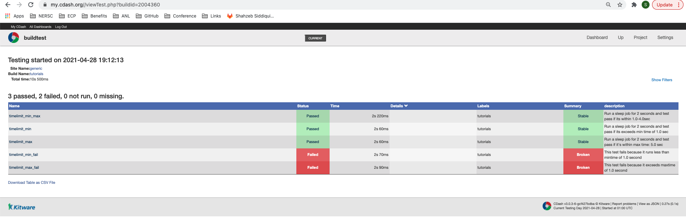

Additional Features
=====================

Accessing build history (``buildtest history``)
------------------------------------------------

.. note::
   ``buildtest hy`` is an alias for ``buildtest history`` command.

buildtest keeps track of all builds (``buildtest build``) that can be retrieved using ``buildtest history`` command
which can be useful when you want to analyze or troubleshoot past builds. The `buildtest history` command comes with two
subcommands ``buildtest history list`` and ``buildtest history query``.

If you want to list all builds you should run **buildtest history list** which will report a table style
format of all builds with corresponding build ID to differentiate each build. Shown below is an example output. The build
IDs start at **0** and increment as you run **buildtest build** command.

.. command-output:: buildtest history list

The ``buildtest history query`` command is particularly useful when you want to inspect a particular build. This command
expects a *Build Identifier* which can be found by inspecting output column `id` in `buildtest history list`.

Shown below is an output of build ID 0 which reports relevant detail for the build such as input command, username, hostname,
platform, date, etc...

.. command-output:: buildtest history query 0
    :shell:

If you want to see all available build IDs, you can use the following command. The ``-t`` is terse format and ``--no-header`` will
omit the headers for each column and pipe the output to **cut** to extract the first column which corresponds to build IDs.

.. command-output:: buildtest hy list -t --no-header | cut -f 1 -d '|'
   :shell:

buildtest has tab complete on ``buildtest history query`` which reports a list of build IDs which is another way to
see available IDs to query.

.. code-block:: console

    $ buildtest history query
    0   1   10  11  12  13  14  15  16  17  18  19  2   20  21  22  23  3   4   5   6   7   8   9

If you want to see logfile for build ID 0 you can use ``--log`` option to see logfile in an editor as follows::

  buildtest history query 0 --log

Accessing buildtest documentation
----------------------------------

We provide two command line options to access main documentation and schema docs. This
will open a browser on your machine.

To access `buildtest docs <https://buildtest.readthedocs.io/>`_ you can run::

  buildtest docs

To access `schema docs <https://buildtesters.github.io/buildtest>`_ you can run::

  buildtest schemadocs

Disabling Colored Output
--------------------------

buildtest will display output in color format using the `rich.Console <https://rich.readthedocs.io/en/stable/reference/console.html#rich.console.Console>`_
class. You can disable colored output via ``buildtest --no-color`` argument or set this
persistent via environment variable **BUILDTEST_COLOR=False**.

.. _cdash_integration:

CDASH Integration (``buildtest cdash``)
-----------------------------------------

The ``buildtest cdash`` command is responsible for uploading tests to CDASH server. You will
need to specify :ref:`cdash_configuration` in your configuration file. Shown below is the command
usage.

.. command-output:: buildtest cdash --help

The ``buildtest cdash upload`` command is responsible for uploading all tests in `report.json`
into CDASH. You must specify a buildname when using **buildtest cdash upload** in this example we will
specify a buildname called `tutorials`::

    $ buildtest cdash upload tutorials
    Reading configuration file:  /Users/siddiq90/Documents/GitHubDesktop/buildtest/buildtest/settings/config.yml
    Reading report file:  /Users/siddiq90/.buildtest/report.json
    build name:  tutorials
    site:  generic
    stamp:  20210428-1512-Experimental
    MD5SUM: d7651cb3fbdd19298b0188c441704c3a
    PUT STATUS: 200
    You can view the results at: https://my.cdash.org//viewTest.php?buildid=2004360

We can see the output of these tests in CDASH if we go to url https://my.cdash.org//viewTest.php?buildid=2004360

By default buildtest will read the report file in your **$HOME/.buildtest/report.json**, we can
specify an alternate report file. First let's see the available help options for
``buildtest cdash upload``.

.. command-output:: buildtest cdash upload --help

We can pass an alternate report file using ``-r`` option when uploading tests
to CDASH. This can be useful if you want to map test results to different buildnames in CDASH
perhaps running a different subset of tests via ``buildtest build --tags`` and upload
the test results with different buildname assuming you have different paths to report file.

Let's say we want to build all python tests using tags and store them in a report file which we
want to push to CDASH with buildgroup name ``python`` we can do that as follows

.. command-output:: buildtest build --tags python -r $BUILDTEST_ROOT/python.json
    :shell:

Next we upload the tests using the ``-r`` option to specify the report file

.. command-output:: buildtest cdash upload -r $BUILDTEST_ROOT/python.json python
    :shell:

The ``buildtest cdash view`` command can be used to open CDASH project in a web browser
using the command line. This feature assumes you have set the CDASH setting in your
configuration file.

Cleaning buildtest files (``buildtest clean``)
------------------------------------------------

The ``buildtest clean`` command can be used to remove files generated by buildtest such
as test files, report files, buildspec cache, and history files. You will be prompted for
response to clean up files for confirmation. If you want to avoid user response you can use ``buildtest clean -y``
to accept confirmation for all prompts and buildtest will remove the files.

.. code-block:: console

    $ buildtest clean
    Remove Test Directory /Users/siddiq90/Documents/GitHubDesktop/buildtest/var/tests (y/n) [default: y]
    Remove Report File /Users/siddiq90/Documents/GitHubDesktop/buildtest/var/report.json (y/n) [default: y]
    Remove History Directory /Users/siddiq90/Documents/GitHubDesktop/buildtest/var/.history (y/n) [default: y]
    Remove Buildspec Cache /Users/siddiq90/Documents/GitHubDesktop/buildtest/var/buildspecs/cache.json (y/n) [default: y]
    ======> Remove Test Directory
    ======> Removing Report File
    ======> Removing History Directory
    ======> Removing buildspec cache

Changing Directories (``buildtest cd``)
----------------------------------------

The ``buildtest cd`` command can be used to change directory to root of test given
a test name. The change will be applied to your shell upon completion of
command. Let's assume we want to change directory to root of test ``exit1_pass`` we can do this as
follows:

.. code-block:: console

    $ buildtest cd exit1_pass
    Changing directory to root of test: exit1_pass/8c4b6ac9-e94e-40d9-8d96-7aaa3a5d3723

    $ pwd
    /Users/siddiq90/Documents/GitHubDesktop/buildtest/var/tests/generic.local.sh/pass_returncode/exit1_pass/8c4b6ac9

In this previous example, buildtest will use the **latest** run for test ``exit1_pass`` and switch directory to root of test.

We can confirm this directory is from the latest run by running the following command. The ``testroot`` is a property
in the report table that can be fetch via ``--format`` field. The ``--latest`` option will fetch
the latest run for the test.

.. code-block:: console

    $ buildtest report --latest --filter name=exit1_pass --format testroot --terse --no-header
    /Users/siddiq90/Documents/GitHubDesktop/buildtest/var/tests/generic.local.sh/pass_returncode/exit1_pass/8c4b6ac9

If you switch cd into a particular build you can specify the name followed by backslash and name of test ID. In this example below,
we will specify test name ``kernel_swapusage/1fa`` and buildtest will attempt to find first record that starts with the test ID and switch
directory to root of test.

.. code-block:: console

    $ buildtest cd kernel_swapusage/1fa
    Changing directory to root of test: kernel_swapusage/1fa21875-b099-41b6-8bc7-30e0d2dcc13b

    $ pwd
    /Users/siddiq90/Documents/GitHubDesktop/buildtest/var/tests/generic.local.bash/kernel_state/kernel_swapusage/1fa21875

Get Path for Test (``buildtest path``)
----------------------------------------

The ``buildtest path`` command is used to display path attributes for a test that is available in the test report.
Shown below are available options for **buildtest path**

.. command-output:: buildtest path -h

If you want to fetch the last run for any given test you can specify the name of the test as follows: ``buildtest path <name>``.
We can specify a test ID for a test by separating the name and test ID with backslash character (``/``) as follows: ``buildtest path <name>/<ID>``

If you don't specify any option you will get root of test. In this example, we will retrieve ``testroot``
for test **variables_bash** which is a property of the test found in the report file.

.. command-output:: buildtest path variables_bash

You can get path to testscript via ``-t`` option as show below

.. command-output:: buildtest path -t variables_bash

If you want to see content of output file, you can use ``-o`` option with **cat** command as follows:

.. command-output:: cat $(buildtest path -o variables_bash)
    :shell:

In this next example we will query test **circle_area** with build ID **aaa** and buildtest will find the first match record that
starts with this record and resolves to **aaaa622d** which is the short ID of test.

.. code-block:: console

    # query testroot for circle_area with build ID "aaa"
    $ buildtest path circle_area/aaa
    /Users/siddiq90/Documents/GitHubDesktop/buildtest/var/tests/generic.local.python/python-shell/circle_area/aaaa622d

    # query testroot for latest run of circle_area
    $ buildtest path circle_area
    /Users/siddiq90/Documents/GitHubDesktop/buildtest/var/tests/generic.local.python/python-shell/circle_area/fc221b84

We have setup mutual exclusion to avoid user from passing two option at same time. If you do run
into this situation you will get the following error.

.. command-output:: buildtest path -o -e variables_bash
    :returncode: 2

If you specify an invalid test name or buildtest can't find the test id, then buildtest will print list of available test names
with IDs.

Buildtest Debug Report (``buildtest debugreport``)
---------------------------------------------------

The ``buildtest debugreport`` command is used for debugging especially when you want to raise
an `issue <https://github.com/buildtesters/buildtest/issues>`_ to buildtest project. This command will provide system details
along with configuration file and output of log file during the report.

.. command-output:: buildtest debugreport

.. _configuration_cli:

Command Line Interface to buildtest configuration
---------------------------------------------------

Once you have implemented your buildtest configuration, you can query the configuration
details using ``buildtest config`` command. Shown below is the command usage.

.. command-output:: buildtest config --help

.. note::
  ``buildtest cg`` is an alias for ``buildtest config`` command.

Validate buildtest configuration (``buildtest config validate``)
~~~~~~~~~~~~~~~~~~~~~~~~~~~~~~~~~~~~~~~~~~~~~~~~~~~~~~~~~~~~~~~~~

First thing you should do once you implement your configuration file  is to make sure your configuration is valid with the schema.
This can be achieved by running ``buildtest config validate``. When you invoke this
command, buildtest will load the configuration and attempt to validate the file with
schema **settings.schema.json**. If validation is successful you will get the following message:

.. command-output:: buildtest config validate

.. Note:: If you defined a user setting (``~/.buildtest/config.yml``) buildtest will validate this file instead of default one.

If there is an error during validation, the output from **jsonschema.exceptions.ValidationError**
will be displayed in terminal. For example the error below indicates that
``moduletool`` property was expecting one of the values
[``environment-modules``, ``lmod``, ``N/A``] but it recieved a value of ``none``:

.. code-block:: console

    $ buildtest config validate
    Traceback (most recent call last):
      File "/Users/siddiq90/Documents/buildtest/bin/buildtest", line 17, in <module>
        buildtest.main.main()
      File "/Users/siddiq90/Documents/buildtest/buildtest/main.py", line 39, in main
        buildtest_configuration = check_settings(settings_file, retrieve_settings=True)
      File "/Users/siddiq90/Documents/buildtest/buildtest/config.py", line 41, in check_settings
        validate(instance=user_schema, schema=config_schema)
      File "/Users/siddiq90/.local/share/virtualenvs/buildtest-1gHVG2Pd/lib/python3.7/site-packages/jsonschema/validators.py", line 934, in validate
        raise error
    jsonschema.exceptions.ValidationError: 'none' is not one of ['environment-modules', 'lmod', 'N/A']

    Failed validating 'enum' in schema['properties']['moduletool']:
        {'description': 'Specify modules tool used for interacting with '
                        '``module`` command. ',
         'enum': ['environment-modules', 'lmod', 'N/A'],
         'type': 'string'}

    On instance['moduletool']:
        'none'

View buildtest configuration (``buildtest config view``)
~~~~~~~~~~~~~~~~~~~~~~~~~~~~~~~~~~~~~~~~~~~~~~~~~~~~~~~~~~

If you want to view buildtest configuration you can run ``buildtest config view`` which will print content of buildtest configuration.

.. command-output:: buildtest config view

.. Note:: ``buildtest config view`` will display contents of user buildtest settings ``~/.buildtest/config.yml`` if found, otherwise it will display the default configuration

.. _view_executors:

View Executors (``buildtest config executors``)
~~~~~~~~~~~~~~~~~~~~~~~~~~~~~~~~~~~~~~~~~~~~~~~~

You can use the command ``buildtest config executors`` to view executors from buildtest
configuration file.  Shown below is the command usage

.. command-output:: buildtest config executors --help

You can run ``buildtest config executors`` without any options and it will report a list of named executors that
you would reference in buildspec using the ``executor`` property. If you prefer json or yaml format you can use ``--json`` or ``--yaml`` option.

.. command-output:: buildtest config executors

View Registered Systems
~~~~~~~~~~~~~~~~~~~~~~~~~

Your buildtest configuration may compose of one or more systems since you can define multiple systems
in a single configuration file to run buildtest for different HPC clusters. You can use
``buildtest config systems`` to report all system details defined in your configuration file.
In this example below we should the ``generic`` system. If you have multiple entries, you will see one
entry per system record.

.. command-output:: buildtest config systems

Configuration Summary
~~~~~~~~~~~~~~~~~~~~~~

You can get a summary of buildtest using ``buildtest config summary``, this will
display information from several sources into one single command along.

.. command-output:: buildtest config summary

Example Configurations
~~~~~~~~~~~~~~~~~~~~~~~

buildtest provides a few example configurations for configuring buildtest this
can be retrieved by running ``buildtest schema -n settings.schema.json --examples``
or short option (``-e``), which will validate each example with schema file
``settings.schema.json``.

.. command-output:: buildtest schema -n settings.schema.json -e

If you want to retrieve full json schema file for buildtest configuration you can
run ``buildtest schema -n settings.schema.json --json`` or short option ``-j``.