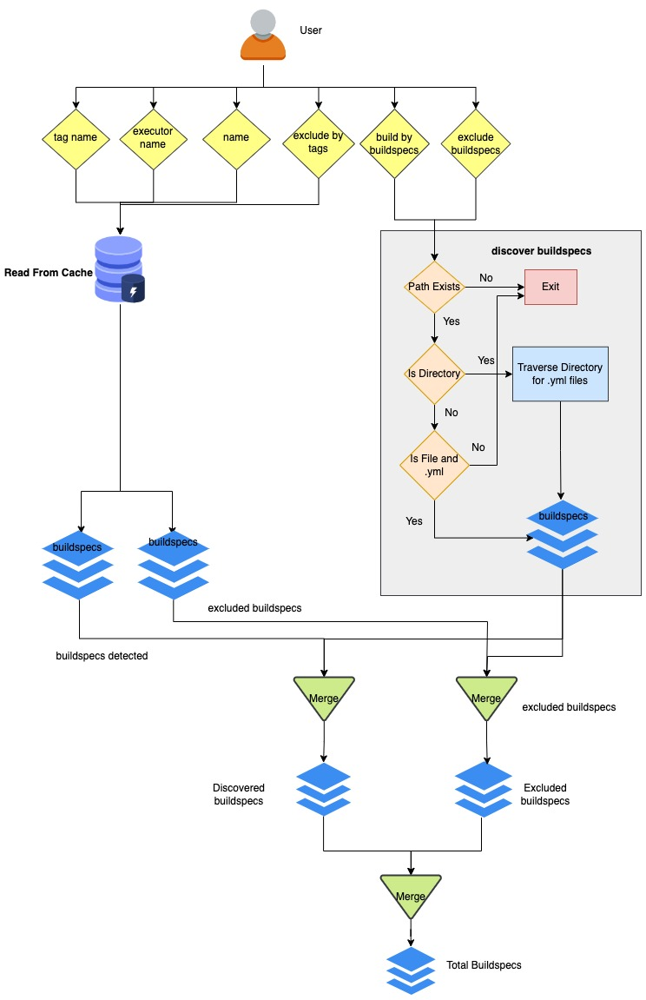

.. _Getting_Started:

Getting Started with buildtest
==============================

Interacting with the client
---------------------------

Once you install buildtest, you should find the client on your $PATH, you can
run the following to see path to buildtest::

      $ which buildtest

If you don't see buildtest go back and review section :ref:`Setup`.

Build Usage
------------

The ``buildtest build`` command is used for building and running tests. Buildtest will read one or more Buildspecs (YAML)
file that adheres to one of the buildtest schemas. For a complete list of build options, run ``buildtest build --help``

.. program-output:: cat docgen/buildtest_build_--help.txt

.. _discover_buildspecs:

Discover Buildspecs
--------------------

The buildspec search resolution is described as follows:

- If file doesn't exist, check for file in :ref:`buildspec_roots` and break after first match

- If buildspec path is a directory, traverse directory recursively to find all ``.yml`` extensions

- If buildspec path is a file, check if file extension is not ``.yml``,  exit immediately

Shown below is a diagram on how buildtest discovers buildspecs. The user
inputs a buildspec via ``--buildspec`` or tags (``--tags``) :ref:`build_by_tags`
which will discover the buildspecs. User can :ref:`exclude_buildspecs`
using ``--exclude`` option which is processed after discovering buildspecs. The
excluded buildspecs are removed from list if found and final list of buildspecs
is processed.

Building a Test
----------------

To build a test, we use the ``--buildspec`` or short option ``-b`` to specify the
path to Buildspec file.

Let's see some examples, first we specify a full path to buildspec file

.. program-output:: cat docgen/getting_started/buildspec-abspath.txt

buildtest won't accept ``.yaml`` file extension for file, this can be demonstrated as
follows::

    $ buildtest build -b invalid_ext.yaml
    invalid_ext.yaml does not end in file extension .yml
    There are no config files to process.

buildtest can perform a directory build for instance let's build
for directory ``tests/examples/buildspecs`` where buildtest will recursively
search for all ``.yml`` files

.. program-output:: cat docgen/getting_started/buildspec-directory.txt

In next section, you will see, we can build multiple buildspecs and interchange
file and directory with ``-b`` option.

Building Multiple Buildspecs
~~~~~~~~~~~~~~~~~~~~~~~~~~~~~~

Buildtest supports building multiple buildspecs, just specify the ``-b`` option
for every Buildspec you want to build. In this example, we specify a file and
directory path. The search resolution is performed for every argument (``-b``)
independently, and accumulated into list.

.. program-output:: cat docgen/getting_started/multi-buildspecs.txt

.. _exclude_buildspecs:

Excluding Buildspecs
~~~~~~~~~~~~~~~~~~~~~

Buildtest provides ``--exclude`` option or short option ``-x`` to exclude
buildspecs which can be useful when you want to build all buildspecs in a directory
but exclude a few buildspecs or exclude a sub-directory.

For example we can build all buildspecs in ``examples`` but exclude file ``examples/systemd.yml``
by running::

    $ buildtest build -b examples -x examples/systemd.yml

buildtest will discover all Buildspecs and then exclude any buildspecs specified
by ``-x`` option. You can specify ``-x`` multiple times just like ``-b`` option.

For example, we can undo discovery by passing same option to ``-b`` and ``-x``  as follows::

    $ buildtest build -b examples/ -x examples/
    There are no Buildspec files to process.

Buildtest will stop immediately if there are no Buildspecs to process, this is
true if you were to specify files instead of directory.

.. _build_by_tags:

Building By Tags
~~~~~~~~~~~~~~~~~

buildtest can perform builds by tags by using ``--tags`` option. In order to use this
feature, buildspecs must be in cache so you must run ``buildtest buildspec find``
or see :ref:`find_buildspecs`.

To build all tutorials tests you can perform ``buildtest build --tags tutorials``.
In the buildspec there is a field ``tags: [tutorials]`` to classify tests.
buildtest will read the cache file ``var/buildspec-cache.json`` and see which
buildspecs have a matching tag. You should run ``buildtest buildspec find``
atleast once, in order to detect cache file.

.. program-output::  cat docgen/getting_started/tags.txt

You can build by multiple tags by specifying ``--tags`` multiple times. In next
example we build all tests with tag name `compiler` and `python`.

.. program-output:: cat docgen/getting_started/multi-tags.txt

When multiple tags are specified, we search each tag independently and if it
is found in the buildspec cache we retrieve the test. To see a list of available
tags in your buildspec cache see :ref:`buildspec_tags`.

.. Note:: The ``--tags`` is used for discovering buildspecs and filtering tests during build phase.
  For example a buildspec file (``system.yml``) that contain three tests **hostname_check**, **timeout**, and **ping_test**
  are generally all run by default if you run as ``buildtest build -b system.yml``, but if you
  specify ``--tags`` buildtest will exclude tests that don't have a matching tagname. It is possible
  ``buildtest build --tags system`` can discover buildspec file ``system.yml`` but only
  tests **timeout** and **ping_test** are built because they have a **system** tag while
  **hostname_check** is skipped because it's test doesn't have a **system** tag.

You can combine ``--tags`` with ``--buildspec`` and ``--exclude`` in a single command.
buildtest will query tags and buildspecs independently and combine all discovered
buildspecs, any duplicates are ignored and finally we apply the exclusion list to
remove buildspecs.

In next example we combine all of these features together. This example builds
all test with **python** tag, and build all buildspecs in directory - **tutorials/compilers**
but we exclude **tutorials/compilers/vecadd.yml**.

.. program-output:: cat docgen/getting_started/combine-tags-buildspec-exclude.txt

Building by Executors
-----------------------

buildtest can build tests by executor name using the ``--executor`` option. If you
to build all test associated to an executor such as ``local.sh`` you can run::

  $ buildtest build --executor local.sh

buildtest will query buildspec cache for the executor name and retrieve a list of
buildspecs with matching executor name. Later we process every buildspec and filter
tests with executor name. In the first stage we retrieve the buildspec file which may
contain one or more test and in second stage we process each test.

To see a list of available executors in buildspec cache see :ref:`buildspec_executor`.

.. Note:: By default all tests are run in buildspec file, the --executor is filtering by tests. This option
   behaves similar to tags, the **--executor** is used for discovering buildspecs and filtering
   tests with corresponding executor name.

In this example we run all tests that are associated to `local.sh` executor. Notice how
buildtest skips tests that don't match executor **local.sh** even though they were
discovered in buildspec file.

.. program-output:: cat docgen/getting_started/single-executor.txt

We can append arguments to ``--executor`` to search for multiple executors by
specifying ``--executor <name1> --executor <name2>``. In next example we search
all tests associated with ``local.sh`` and ``local.bash`` executor.

.. Note:: If you specify multiple executors, buildtest will combine the executors
   into list, for example ``--executor local.bash --executor local.sh`` is converted
   into a list (executor filter) - ``[local.bash, local.sh]``, and buildtest will
   skip any test whose ``executor`` field in testname doesn't belong to executor
   filter list are skipped.

.. program-output:: cat docgen/getting_started/multi-executor.txt

Control builds by Stages
-------------------------

You can control behavior of ``buildtest build`` command to stop at certain point
using ``--stage`` option. This takes two values ``parse`` or ``build``, which will
stop buildtest after parsing buildspecs or building the test content.

If you want to know your buildspecs are valid you can use ``--stage=parse`` to stop
after parsing the buildspec. Shown below is an example build where we stop
after parse stage.

.. program-output:: cat docgen/getting_started/stage_parse.txt

Likewise, if you want to troubleshoot your test script without running them you can
use ``--stage=build`` which will stop after building your test script. This can
be extremely useful when writing your buildspecs and not having to run your tests.
In this next example, we stop our after the build stage using ``--stage=build``.

.. program-output:: cat docgen/getting_started/stage_build.txt

.. _invalid_buildspecs:

Invalid Buildspecs
~~~~~~~~~~~~~~~~~~~~

buildtest will skip any buildspecs that fail to validate, in that case
the test script will not be generated. Here is an example where we have an invalid
buildspec.

.. program-output:: cat docgen/getting_started/invalid-buildspec.txt

buildtest may skip tests from running if buildspec specifies an invalid
executor name since buildtest needs to know this in order to delegate test
to Executor class responsible for running the test. Here is an example
where test failed to run since we provided invalid executor.

.. program-output:: cat docgen/getting_started/invalid-executor.txt

Rebuild Tests
--------------

buildtest can rebuild tests using the ``--rebuild`` option which can be useful if
you want to test a particular test multiple times. The rebuild option works across
all discovered buildspecs and create a new test instance (unique id) and test directory
path. To demonstrate we will build ``tutorials/python-shell.yml`` three times using
``--rebuild=3``.

.. program-output:: cat docgen/getting_started/rebuild.txt

The rebuild works with all options including: ``--buildspec``, ``--exclude``, ``--tags``
and ``--executors``.

In the next example we rebuild tests by discovering all tags that contain **fail**.

.. program-output:: cat docgen/getting_started/rebuild-tags.txt

The rebuild option expects a range between **1-50**, the ``--rebuild=1`` is equivalent
to running without ``--rebuild`` option. We set a max limit for rebuild option to
avoid system degredation due to high workload.

If you try to exceed this bound you will get an error such as::

    $ buildtest build -b tutorials/pass_returncode.yml --rebuild 51
    usage: buildtest [options] [COMMANDS] build [-h] [-b BUILDSPEC] [-x EXCLUDE] [--tags TAGS] [-e EXECUTOR]
                                                [-s {parse,build}] [-t TESTDIR] [--rebuild REBUILD] [--settings SETTINGS]
    buildtest [options] [COMMANDS] build: error: argument --rebuild: 51 must be a positive number between [1-50]

Buildspecs Interface
----------------------

buildtest is able to find and validate all buildspecs in your repos. The
command ``buildtest buildspec`` comes with the following options.

.. program-output:: cat docgen/buildtest_buildspec_--help.txt

.. _find_buildspecs:

Finding Buildspecs
~~~~~~~~~~~~~~~~~~~~

To find all buildspecs run ``buildtest buildspec find`` which will discover
all buildspecs in all repos by recursively finding all `.yml` extensions.

.. program-output:: cat docgen/getting_started/buildspec-find.txt
   :ellipsis: 50

buildtest will validate each buildspec file with the appropriate
schema type. buildspecs that pass validation will be displayed on screen.
buildtest will report all invalid buildspecs in a text file for you to review.

buildtest will cache the results in **var/buildspec-cache.json** so subsequent
runs to ``buildtest buildspec find`` will be much faster because it is read from cache.
If you make changes to buildspec you may want to rebuild the buildspec cache then
run::

  $ buildtest buildspec find --clear

Shown below is a list of options for ``buildtest buildspec find`` command.

.. program-output:: cat docgen/buildtest_buildspec_find_--help.txt

If you want to find all buildspec files in cache run ``buildtest buildspec find --buildspec-files``

.. program-output:: cat docgen/buildspec_find_buildspecfiles.txt
     :ellipsis: 30

Filtering buildspec
~~~~~~~~~~~~~~~~~~~

You can filter buildspec cache using the the ``--filter`` option. Let's take a look
at the available filter fields that are acceptable with filter option.

.. program-output:: cat docgen/buildspec-filter.txt

The ``--filter`` option accepts arguments in key/value format as follows::

    buildtest buildspec find --filter key1=value1,key2=value2,key3=value3

We can filter buildspec cache by ``tags=fail`` which will query all tests with
associated tag field in test.

.. program-output:: cat docgen/buildspec_filter_tags.txt

In addition, we can query buildspecs by schema type, in next example we query
all tests using the `script` schema

.. program-output:: cat docgen/buildspec_filter_type.txt

Finally, we can combine multiple filter fields separated by comma, in next example
we query all buildspecs with ``tags=tutorials``, ``executor=local.sh``, and ``type=script``

.. program-output:: cat docgen/buildspec_multifield_filter.txt

.. _buildspec_tags:

Querying buildspec tags
~~~~~~~~~~~~~~~~~~~~~~~~

If you want to retrieve all unique tags from all buildspecs you can run
``buildtest buildspec find --tags``

.. program-output:: cat docgen/buildspec_find_tags.txt

.. _buildspec_executor:

Querying buildspec executor
~~~~~~~~~~~~~~~~~~~~~~~~~~~~

To find all executors from cache you can run ``buildtest buildspec find --list-executors``.
This will retrieve the `'executor'` field from all buildspec and any duplicates will
be ignored.

.. program-output:: cat docgen/buildspec_find_executors.txt

Viewing Buildspecs
~~~~~~~~~~~~~~~~~~~~
If you want to view or edit a buildspec you can type the name of test. Since we
can have more than one test in a buildspec, opening any of the `name` entry
that map to same file will result in same operation.

For example, we can view ``systemd_default_target`` as follows

.. program-output:: cat docgen/getting_started/buildspec-view.txt

Editing Buildspecs
~~~~~~~~~~~~~~~~~~~~

To edit a buildspec you can run ``buildtest buildspec edit <name>`` which
will open file in editor. Once you make change, buildtest will validate the
buildspec upon closure, if there is an issue buildtest will report an error
during validation and you will be prompted to fix issue until it is resolved.

For example we can see an output message after editing file, user will be prompted
to press a key which will open the file in editor::

    $ buildtest buildspec edit systemd_default_target
    version 1.1 is not known for type {'1.0': 'script-v1.0.schema.json', 'latest': 'script-v1.0.schema.json'}. Try using latest.
    Press any key to continue

.. _test_reports:

Test Reports (``buildtest report``)
-------------------------------------

buildtest keeps track of all test results which can be retrieved via
**buildtest report**. Shown below is command usage.

.. program-output:: cat docgen/buildtest_report_--help.txt

You may run ``buildtest report`` and buildtest will display report
with default format fields.

.. program-output:: cat docgen/report.txt
   :ellipsis: 20

Format Reports
~~~~~~~~~~~~~~~

There are more fields captured in the report, so if you want to see a
list of available format fields run ``buildtest report --helpformat``.

.. program-output:: cat docgen/report-helpformat.txt

You can format report using ``--format`` field which expects field
name separated by comma (i.e **--format <field1>,<field2>**). In this example
we format by fields ``--format id,executor,state,returncode``

.. program-output:: cat docgen/report-format.txt
   :ellipsis: 20

Filter Reports
~~~~~~~~~~~~~~~~

You can also filter reports using the ``--filter`` option, but first let's
check the available filter fields. In order to see available filter fields
run ``buildtest report --helpfilter``.

.. program-output:: cat docgen/report-helpfilter.txt

The ``--filter`` expects arguments in **key=value** format, you can
specify multiple filter fields by a comma. buildtest will treat multiple
filters as logical **AND** operation. The filter option can be used with
``--format`` field. Let's see some examples to illustrate the point.

To see all tests with returncode of 2 we set ``--filter returncode=2``.

.. program-output:: cat docgen/report-returncode.txt

.. Note:: buildtest automatically converts returncode to integer when matching returncode, so ``--filter returncode="2"`` will work too

If you want to filter by test name ``exit1_pass`` you can use the
``name=exit1_pass`` field as shown below

.. program-output:: cat docgen/report-filter-name.txt

Likewise, we can filter tests by buildspec file using the ``--filter buildspec=<file>``.
In example below we set ``buildspec=tutorials/pass_returncode.yml``. In this example,
buildtest will resolve path and find the buildspec. If file doesn't exist or is
not found in cache it will raise an error

.. program-output:: cat docgen/report-filter-buildspec.txt

We can also pass multiple filter fields for instance if we want to find all **FAIL**
tests for executor **local.sh** we can do the following

.. program-output:: cat docgen/report-multifilter.txt

Filter Exception Cases
~~~~~~~~~~~~~~~~~~~~~~~~

The ``returncode`` filter field expects an integer value, so if you try a non-integer
returncode you will get the following message::

    $ buildtest report --filter returncode=1.5
    Traceback (most recent call last):
      File "/Users/siddiq90/Documents/buildtest/bin/buildtest", line 17, in <module>
        buildtest.main.main()
      File "/Users/siddiq90/Documents/buildtest/buildtest/main.py", line 45, in main
        args.func(args)
      File "/Users/siddiq90/Documents/buildtest/buildtest/menu/report.py", line 128, in func_report
        raise BuildTestError(f"Invalid returncode:{filter_args[key]} must be an integer")
    buildtest.exceptions.BuildTestError: 'Invalid returncode:1.5 must be an integer'

The ``state`` filter field expects value of ``PASS`` or ``FAIL`` so if you specify an
invalid state you will get an error as follows::

    $ buildtest report --filter state=UNKNOWN
    filter argument 'state' must be 'PASS' or 'FAIL' got value UNKNOWN

The ``buildspec`` field expects a valid file path, it can be an absolute or relative
path, buildtest will resolve absolute path and check if file exist and is in the report
file. If it's an invalid file we get an error such as::

    $ buildtest report --filter buildspec=/path/to/invalid.yml
    Invalid File Path for filter field 'buildspec': /path/to/invalid.yml

You may have a valid filepath for buildspec filter field such as
``tutorials/invalid_executor.yml``, but there is no record in the report cache
because this test can't be run. In this case you will get the following message::

    $ buildtest report --filter buildspec=tutorials/invalid_executor.yml
    buildspec file: /Users/siddiq90/Documents/buildtest/tutorials/invalid_executor.yml not found in cache

.. _buildtest_schemas:

buildtest schemas
------------------

The ``buildtest schema`` command can show you list of available schemas just run
the command with no options and it will show all the json schemas supported by buildtest.

.. program-output:: cat docgen/schemas/avail-schemas.txt

Shown below is the command usage of ``buildtest schema``

.. program-output:: cat docgen/buildtest_schema_--help.txt

The json schemas are hosted on the web at https://buildtesters.github.io/schemas/.
buildtest provides a means to display the json schema from the buildtest interface.
Note that buildtest will show the schemas provided in buildtest repo and not
ones provided by `schemas <https://github.com/buildtesters/schemas>`_ repo. This
is because, we let development of schema run independent of the framework.

To select a JSON schema use the ``--name`` option to select a schema, for example
to view a JSON Schema for **script-v1.0.schema.json** run the following::

  $ buildtest schema --name script-v1.0.schema.json --json

Similarly, if you want to view example buildspecs for a schema use the ``--example``
option with a schema. For example to view all example schemas for
**compiler-v1.0.schema.json** run the following::

  $ buildtest schema --name compiler-v1.0.schema.json --example

Debug Mode
------------

buildtest can stream logs to ``stdout`` stream for debugging. You can use ``buildtest -d <DEBUGLEVEL>``
or long option ``--debug`` with any buildtest commands. The DEBUGLEVEL are the following:

- DEBUG
- INFO
- WARNING
- ERROR
- CRITICAL

buildtest is using `logging.setLevel <https://docs.python.org/3/library/logging.html#logging.Logger.setLevel>`_
to control log level. The content is logged in file **buildtest.log** in your current
directory with default log level of ``DEBUG``. If you want to get all logs use
``-d DEBUG`` with your buildtest command::

    buildtest -d DEBUG <command>

The debug mode can be useful when troubleshooting builds, in this example we
set debug level to ``DEBUG`` for an invalid buildspec.

.. program-output:: cat docgen/getting_started/debug-mode.txt

Accessing buildtest documentation
----------------------------------

We provide two command line options to access buildtest and schema docs. To
access buildtest docs you can run::

  $ buildtest docs

To access schema docs run::

  $ buildtest schemadocs

Logfile
-------

Currently, buildtest will write the log file for any ``buildtest build`` command
in ``buildtest.log`` of the current directory. The logfile will be overwritten
if you run repeative commands from same directory. A permanent log file location
will be implemented (TBD).
