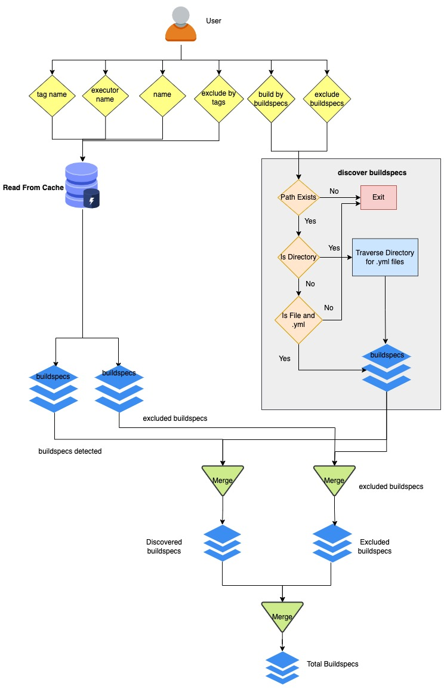

.. _building_test:

Building Test via buildtest (``buildtest build``)
=================================================

This guide will get you familiar with buildtest command line interface. Once
you complete this section, you can proceed to :ref:`writing buildspecs <writing_buildspecs>`
section where we will cover how to write buildspecs.

Once you install buildtest, you should find the `buildtest` command in your **$PATH**.
You can check the path to buildtest command by running::

      $ which buildtest

If you don't see buildtest go back and :ref:`install buildtest <installing_buildtest>`.

When you clone buildtest, you also get a set of buildspecs that you can run on your
system. The ``buildtest build`` command is used for building and running tests.
Buildtest will read one or more buildspecs file that adheres to one of the
buildtest schemas. For a complete list of build options please run ``buildtest build --help``.

.. note::
   ``buildtest bd`` is an alias for ``buildtest build`` command.

Build Usage
------------

.. command-output:: buildtest build --help
   :shell:

Building a Test
----------------

To build a test, we use the ``--buildspec`` or short option ``-b`` to specify the
path to buildspec file. Let's see some examples, first we specify a full path to buildspec file.
In this example, buildtest will :ref:`discover buildspecs <discover_buildspecs>` followed by
parsing the test with appropriate schema and generate a shell script that is run
by buildtest. You can learn more about :ref:`build and test process <build_and_test_process>`.

.. command-output:: buildtest build -b $BUILDTEST_ROOT/tutorials/vars.yml
    :shell:

.. Note::
    buildtest will only read buildspecs with ``.yml`` extension, if you specify a
    ``.yaml`` it will be ignored by buildtest.

The ``--buildspec`` option can be used to specify a file or directory path. If you want
to build multiple buildspecs in a directory you can specify the directory path
and buildtest will recursively search for all ``.yml`` files. In the next example,
we build all tests in directory **general_tests/configuration**.

.. command-output:: buildtest build -b general_tests/configuration/

Building Multiple Buildspecs
------------------------------

You can append ``-b`` option to build multiple buildspecs in the same
command. Buildtest will discover buildspecs for every argument (``-b``) and accumulate
a list of buildspecs to run. In this example, we instruct buildtest to build
a buildspec file and all buildspecs in a directory path.

.. command-output:: buildtest build -b general_tests/configuration/ -b tutorials/vars.yml

.. _exclude_buildspecs:

Excluding Buildspecs
---------------------

So far we learned how to build buildspecs by file and directory path using the ``-b``
option. Next, we will discuss how one may exclude buildspecs which behaves similar to
``-b`` option. You can exclude buildspecs via ``--exclude`` or short option ``-x``
which can be useful when you want to exclude certain files or sub directory.

For example we can build all buildspecs in ``tutorials`` but exclude file ``tutorials/vars.yml``
by running::

    $ buildtest build -b tutorials -x tutorials/vars.yml

buildtest will discover all buildspecs and then exclude any buildspecs specified
by ``-x`` option. You can specify ``-x`` multiple times just like ``-b`` option.

For example, we can undo discovery by passing same option to ``-b`` and ``-x``  as follows

.. command-output:: buildtest bd -b tutorials/ -x tutorials/
    :returncode: 1

Buildtest will stop immediately if there are no Buildspecs to process, this is
true if you were to specify files instead of directory.

In this example, we build all buildspecs in a directory but exclude a file. Buildtest
will report the excluded buildspecs in the output and ``-x`` option can be appended multiple times.
The ``-x`` can be a file or a directory and behaves similar to ``-b`` option.

.. command-output:: buildtest bd -b general_tests/configuration/ -x general_tests/configuration/ulimits.yml

.. _build_by_tags:

Building By Tags
-----------------

buildtest can perform builds by tags by using ``--tags`` or short option (``-t``).
In order to use this feature, buildtest must load buildspecs in :ref:`cache <find_buildspecs>` which can be run
via ``buildtest buildspec find``. If you are unsure of the available tags you can
run ``buildtest buildspec find --tags`` or let buildtest tab-complete the available tags. For more details
see :ref:`buildspec_tags`.

Let's assume you want to build by tag name ``network``, buildtest
will attempt to find all tests that contain ``tags: ['network']`` in the buildspec
which is loaded in the buildcache cache. If a test matches the tag name, the test
will be picked up during the discover process.

.. command-output:: buildtest build -t network

You can build by multiple tags by specifying ``--tags`` multiple times. In next
example we build all tests with tag name ``pass`` and ``python``.

.. command-output:: buildtest build -t python -t pass

When multiple tags are specified, we search each tag independently and if it's
found in the buildspec cache we retrieve the buildspec file and add file to queue.
This queue is a list of buildspecs that buildtest will process (i.e ``parse``, ``build``, ``run``).
You can :ref:`query tags <buildspec_tags>` from buildspecs cache to see all available
tags by running ``buildtest buildspec find --tags``.

.. Note:: The ``--tags`` is used for discovering buildspec file and not filtering tests
   by tag.

You can combine ``--tags`` with ``--buildspec`` to discover buildspecs in a single command.
buildtest will query tags and buildspecs independently and combine all discovered
buildspecs together.

.. command-output:: buildtest build --tags pass --buildspec tutorials/python-hello.yml

As you may see, there are several ways to build buildspecs with buildtest. Tags is
great way to build a whole collection of tests if you don't know path to all the files. You can
specify multiple tags per buildspecs to classify how test can be run.

.. _build_by_executor:

Building by Executors
---------------------

Every buildspec is associated to an executor which is responsible for running the test.
You can instruct buildtest to run all tests by given executor via ``--executor`` option or short option ``-e``.
For instance, if you want to build all test associated to executor ``generic.local.csh`` you can run::

  $ buildtest build --executor generic.local.csh

buildtest will query buildspec cache for the executor name and retrieve a list of
buildspecs with matching executor name. To see a list of available executors in
buildspec cache see :ref:`querying buildspec executor <buildspec_executor>`.

.. Note:: By default all tests are run in buildspec file.  The ``buildtest build --executor`` option discovers
   buildspecs if one of the test matches the executor name. The ``--executor`` option
   is **not filtering tests but only discovering buildspecs**.

In this example we run all tests that are associated to ``generic.local.csh`` executor.

.. command-output:: buildtest build --executor generic.local.csh

.. Note:: The ``--executor`` option can be appended to discover tests by multiple executors.

.. _filter_buildspecs_with_buildtest_build:

Filtering Buildspecs
---------------------

buildtest has support for filtering buildspecs based on certain attributes defined in buildspec file. Upon :ref:`discover_buildspecs`, buildtest
will filter out tests or entire buildspec files. The ``buildtest build --filter`` option can be used to filter buildspecs which expects a **single**
key=value pair. Currently, buildtest can filter tests based on ``tags``, ``type`` and ``maintainers``.

To see all available filter fields you can run ``buildtest build --helpfilter`` and buildtest will
report the fields followed by description.

.. command-output:: buildtest build --helpfilter

In this example, we will discover all buildspecs based on tagname ``pass`` and then filter each **test** by tagname **pass** specified by ``--filter tags=pass``.

.. command-output:: buildtest build -t pass --filter tags=pass

buildtest can run filter tests by :ref:`maintainers <maintainers>`, this can be useful if you want to run tests that you are maintainer. The ``maintainers`` field is
set per buildspec and not each test. You can filter maintiners via ``--filter maintainers=<MAINTAINER_NAME>``. If the ``maintainers`` field is not specified
the buildspec will be filtered out if ``--filter maintainers`` is specified. In this next example, we will build all tests for maintainer
``@shahzebsiddiqui``.

.. command-output:: buildtest build -b tutorials --filter maintainers=@shahzebsiddiqui

Please see :ref:`buildspec_maintainers` on list of maintainers and breakdown of buildspecs by maintainers.

We can also filter tests by ``type`` field in the buildspec which corresponds to the schema type. In this next example, we filter all tests by script schema type by
passing option ``--filter type=script``. We inform buildtest to stop after build stage (``--stage=build``) for more details see :ref:`build_stage`.

.. command-output:: buildtest build -b tutorials --filter type=script --stage=build

.. _discover_buildspecs:

Discover Buildspecs
--------------------

Now, let's discuss how buildtest discovers buildspecs since there are several ways to build
buildspecs.

The buildspec search resolution is described as follows:

- If file or directory specified by ``-b`` option doesn't exist we exit immediately.

- If buildspec path is a directory, traverse directory recursively to find all ``.yml`` extensions

- If buildspec path is a file, check if file extension is not ``.yml``,  exit immediately

- If user specifies ``--tags`` or ``--executor`` we search in buildspec cache to discover buildspecs.

Shown below is a diagram on how buildtest discovers buildspecs. The user can build buildspecs
by ``--buildspec``, :ref:`--tags <build_by_tags>`, or :ref:`--executor <build_by_executor>`
which will discover the buildspecs. You can :ref:`exclude buildspecs <exclude_buildspecs>`
using ``--exclude`` option which is processed after discovering buildspecs. The
excluded buildspecs are removed from list if found and final list of buildspecs
is processed.

.. _build_stage:

Configure Build Stages
-----------------------

We can control behavior of ``buildtest build`` command to stop at certain phase
using ``--stage`` option. The **--stage** option accepts ``parse`` or ``build``, which
will instruct buildtest to stop at parse or build phase of the pipeline.

Buildtest will validate all the buildspecs in the parse stage, so you can
instruct buildtest to stop at parse stage via ``--stage=parse``. This can be useful
when debugging buildspecs that are invalid. In this example below, we instruct
buildtest to stop after parse stage.

.. command-output:: buildtest build -b tutorials/vars.yml --stage=parse

Likewise, if you want to troubleshoot your test script without running them you can
use ``--stage=build`` which will stop after build phase. This can
be used when you are writing buildspec to troubleshoot how test is generated.
In this next example, we inform buildtest to stop after build stage.

.. command-output:: buildtest build -b tutorials/vars.yml --stage=build

.. _invalid_buildspecs:

Invalid Buildspecs
--------------------

buildtest will skip any buildspecs that fail to validate, in that case
the test script will not be generated. Here is an example where we have an invalid
buildspec.

.. command-output:: buildtest build -b tutorials/invalid_buildspec_section.yml
    :returncode: 1

buildtest may skip tests from running if buildspec specifies an invalid
executor name since buildtest needs to know this in order to delegate test
to Executor class responsible for running the test. Here is an example
where test failed to run since we provided invalid executor.

.. command-output:: buildtest build -b tutorials/invalid_executor.yml
    :returncode: 1

Rebuild Tests
--------------

buildtest can rebuild tests using the ``--rebuild`` option which can be useful if
you want to test a particular test multiple times. The rebuild option works across
all discovered buildspecs and create a new test instance (unique id) and test directory
path. To demonstrate we will build ``tutorials/python-shell.yml`` three times using
``--rebuild=3``.

.. command-output:: buildtest build -b tutorials/python-shell.yml --rebuild=3

The rebuild works with all options including: ``--buildspec``, ``--exclude``, ``--tags``
and ``--executor``. buildtest will perform rebuild for all discovered tests, for instance in
this next example we will discover all tests by tag name **fail** and each test is rebuild twice.

.. command-output:: buildtest build -t fail --rebuild 2

The rebuild option expects a range between **1-50**, the ``--rebuild=1`` is equivalent
to running without ``--rebuild`` option. We set a max limit for rebuild option to
avoid system degredation due to high workload.

If you try to exceed this bound you will get an error such as

.. command-output:: buildtest build -b tutorials/pass_returncode.yml --rebuild 51
    :returncode: 1

Specify Modules in command line
--------------------------------

If your system supports ``modules`` such as environment-modules or Lmod you can specify a list
of modules to load (``module load``) in the test via ``buildtest build --modules``. You can specify
a comma separated list of modules to load, for example if you want to load `gcc` and `python` module in
your test you can run ``buildtest build --modules gcc,python``. You may specify full name of module with
version for instance you want test to load `gcc/9.3.0` and `python/3.7` you can run ``buildtest build --modules gcc/9.3.0,python/3.7``.

If you want test to run ``module purge`` before running test you can specify ``buildtest build --module-purge`` option. If you specify
``--module-purge`` and ``--modules`` then ``module purge`` will be run prior to loading any modules.

Use Alternate Configuration file
---------------------------------

If you want to use an alternate configuration file when building test you can use ``buildtest -c <config> build``.
buildtest will prefer configuration file on command line over the user configuration (``$HOME/.buildtest/config.yml``). For more
details see :ref:`which_configuration_file_buildtest_reads`.

Keeping Stage Directory
------------------------

buildtest will create setup the test environment in the `stage` directory where test will be executed. Once
test is complete, buildtest will remove the `stage` directory. If you
want to preserve the stage directory you can use ``buildtest build --keep-stage-dir``, this
is only useful if you want to run the test manually

Specify Project Account for batch jobs
----------------------------------------

For batch jobs you typically require one to specify a project account in order to charge jobs depending on your
scheduler you can use ``buildtest build --account`` option and specify an account name. The command line
argument ``--account`` will override configuration setting. For more details see :ref:`project_account`

